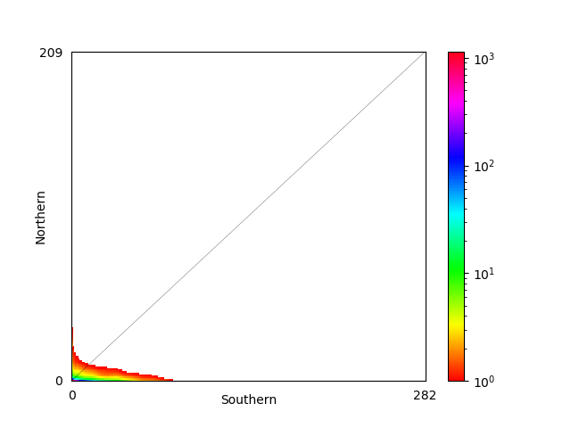

```{r packages, message=FALSE, warning=FALSE, include=FALSE}
require(knitr)
require(tidyverse)
require(DiagrammeR)
require(dplyr)
require(plotly)
require(stringr)
require(psych)
require(readr)

```


__Document Summary:__  
This is an R notebook for the portion of the _Fundulus heteroclitus_ clinal genetics analysis that uses the site frequency spectrum to estimate divergence (Fst), model past demographic scenarios (DADI and MOMENTS), and calculate popgen summary statistics (Theta, TajD etc). Preceding analyses can be found in a second R notebook. 

Top level summaries of methods and results are given in the main text. More detailed explanatation of each step are provided as comments in a header or footer within each code chunk.

Code chunks in R, python and bash are generally run locally, while shell scripts are nearly always run remotely on the Clark University high performance computing cluster.

# Analysis outline

```{r}
grViz("digraph flowchart {
      # node definitions with substituted label text
      node [fontname = Helvetica, shape = rectangle]        
      tab1 [label = '@@1']
      tab2 [label = '@@2']
      tab3 [label = '@@3']
      tab4 [label = '@@4']
      tab5 [label = '@@5']
      tab6 [label = '@@6']
      tab7 [label = '@@7']
      tab8 [label = '@@8']

      # edge definitions with the node IDs
      tab1 -> tab2
      tab2 -> tab3
      tab3 -> tab4 -> tab5
      tab3 -> tab6
      tab3 -> tab7
      tab8 -> tab1
      }

      [1]: 'ANGSD -GL 1 -doSAF unfolded'
      [2]: 'SAF'
      [3]: 'SFS (realSFS)'
      [4]: 'Dadi conversion '
      [5]: 'moments/Dadi'
      [6]: 'theta, tajD'
      [7]: 'FST'
      [8]: 'bam files'
      
      ")

```

In this second analysis we calculate site allele frequencies from the genotype likelihoods, then use this SAF to generate site frequency spectra. This SFS can be used for demographic modelling to examine the hypothesis that contemporary _F. heteroclitus_ population genetic structure was shaped by post-glacial secondary recontact between the main population and a northern glacial refugia population. Secondarily, the SFS cna be used to calculate site-wise FST and other site wise stats (theta and Tajima's D) and may be included in the main analysis if an outlier approach to identifying adaptive genetic variation is desirable.

# Software Install  

dadi and moments have several dependencies that are difficult to get together on the cluster. We'll get around this by setting up an virtual environment on the cluster for running dadi

```{bash, eval = FALSE}
#this is the install for stuff on the server
#make the directories in the software directory
mkdir demography

#clone the repos into the directory
git clone https://bitbucket.org/simongravel/moments.git
git clone https://bitbucket.org/gutenkunstlab/dadi.git
git clone https://github.com/dportik/moments_pipeline.git
git clone https://github.com/dportik/dadi_pipeline.git


#create the virtual environment in the directory using python3
python -m venv env

virtualenv

#activate

#install dependcies and angsd
pip install cython
pip install numpy
pip install scipy
pip install matplotlib
pip install mpmath
pip install networkx
pip install pandas

#install moments
clone the repo then install with:
python setup.py install

#deactive virtualenv
deactivate

#when running in batch script make sure to source this virtual env before executing the actual command this is done with the command below
source /home/ddayan/software/demography/bin/activate


```


```{bash, eval = FALSE}

#!/bin/bash

# set max wall-clock time (D-HH:MM:SS)
#SBATCH --time=0-23:59:00

#SBATCH --cpus-per-task=1

# set partition/queue to use
#SBATCH --partition=day-long-cpu

# set name of job
#SBATCH --job-name=moments_check

# set name of output file
#SBATCH --output=moments_test.out

source /home/ddayan/software/demography/env/bin/activate
python /home/ddayan/software/demography/moments/test.py

```


```{bash, eval = FALSE}
#this is the install for local moments
# installed all dependencies using conda, had to install pkg-config as well because the make file was not working correctly
```


# Estimate SFS

__SFS Analysis Outline__  
* Make consensus sequence from grandis reads to polarize the SAF - doFasta -2  
* estimate SAFs for each population and metapopulation  -doSAF
* estimate per population SFS  
* estimate 2dSFS for each pair of populations  
* 1d and 2dSFS used in downstream analyses: per-site summary statistics, global Fst, and dadi  


### SAF estimation and acenstral sequence

Estimate site allele frequency probabilities for each population. 

__ancestral sequence__

First we need the ancestral sequence for eventual unfolded SFS calculation. This is accomplished by polarizing the SAF using an outgroup (f grandis). We estimate the ancestral sequence by making a consensus sequence among the F grandis reads


```{bash, eval = FALSE}

#!/bin/bash

# set max wall-clock time (D-HH:MM:SS)
#SBATCH --time=6-23:59:00

#SBATCH --cpus-per-task=38

# set partition/queue to use
#SBATCH --partition=week-long-cpu

# set name of job
#SBATCH --job-name=consensus

# set name of output file
#SBATCH --output=consensus.out


# use doFasta -2 with -doCounts 1 and the same filters as $FILTERS from the GL run

ANGSD="/opt/angsd0.928/angsd/angsd"
REF="/home/ddayan/fundulus/genome/f_het_genome_3.0.2.fa.gz"

FILTERS="-uniqueOnly 1 -remove_bads 1 -trim 0 -C 50 -baq 1 -minMapQ 20"
DOS="-doFasta 2 -doCounts 1 -dumpCounts 2" 

$ANGSD -P 38 -b ../meta_data/grandis.bams -ref $REF -out ./Results/grandis_consensus.fa \
  $FILTERS $DOS \
```


__make population-wise bamfiles__  
Here we need to split the bams into population to estimate SAFs

```{bash, eval = FALSE}
# the final set of fish is in good_nograndis2 bamlist, split into populations

mkdir filtered_bams
grep "BP_[0-9]*" good_no_grandis_2.bamlist > ./filtered_bams/BP.bams
grep "CT_[0-9]*" good_no_grandis_2.bamlist > ./filtered_bams/CT.bams
grep "GA_[0-9]*" good_no_grandis_2.bamlist > ./filtered_bams/GA.bams
grep "Hb_[0-9]*" good_no_grandis_2.bamlist > ./filtered_bams/HB.bams
grep "KC_[0-9]*" good_no_grandis_2.bamlist > ./filtered_bams/KC.bams
grep "M_[0-9]*" good_no_grandis_2.bamlist > ./filtered_bams/M.bams
grep "MDIBL_[0-9]*" good_no_grandis_2.bamlist > ./filtered_bams/MDIBL.bams
grep "ME_[0-9]*" good_no_grandis_2.bamlist > ./filtered_bams/ME.bams
grep -i "MG_[0-9]*" good_no_grandis_2.bamlist > ./filtered_bams/MG.bams
grep "NBH_[0-9]*" good_no_grandis_2.bamlist > ./filtered_bams/NBH.bams
grep "F_[0-9]*" good_no_grandis_2.bamlist >> ./filtered_bams/NBH.bams
grep "/H_[0-9]*" good_no_grandis_2.bamlist >> ./filtered_bams/NBH.bams
grep "/P_[0-9]*" good_no_grandis_2.bamlist >> ./filtered_bams/NBH.bams
grep -i "SYC_[0-9]*" good_no_grandis_2.bamlist >> ./filtered_bams/NBH.bams
grep "/NC_[0-9]*" good_no_grandis_2.bamlist > ./filtered_bams/NC.bams
grep "OC_[0-9]*" good_no_grandis_2.bamlist > ./filtered_bams/OC.bams
grep "RB_[0-9]*" good_no_grandis_2.bamlist > ./filtered_bams/RB.bams
grep "SC_[0-9]*" good_no_grandis_2.bamlist > ./filtered_bams/SC.bams
grep "SH_[0-9]*" good_no_grandis_2.bamlist > ./filtered_bams/SH.bams
grep "SLC_[0-9]*" good_no_grandis_2.bamlist > ./filtered_bams/SLC.bams
grep "SR_[0-9]*" good_no_grandis_2.bamlist > ./filtered_bams/SR.bams
grep "WNC_[0-9]*" good_no_grandis_2.bamlist > ./filtered_bams/WNC.bams


cd ./filtered_bams
cat BP.bams CT.bams HB.bams M.bams MDIBL.bams ME.bams NBH.bams SLC.bams SR.bams > northern_clade.bams
cat GA.bams KC.bams MG.bams NC.bams OC.bams RB.bams SC.bams SH.bams WNC.bams > southern_clade.bams

#filtering out highly admixed inds
grep -f non-admixed_inds.txt southern_clade.bams > southern_non_admixed.bams
grep -f non-admixed_inds.txt northern_clade.bams > northern_non_admixed.bams

#filtering out admixed populations should this also be be done on the basis of FST
SH, RB, OC, MG, KC, CT, SR, HB, BP

cat M.bams MDIBL.bams ME.bams NBH.bams SLC.bams  > northern_no_adm_pops.bams
cat GA.bams NC.bams SC.bams WNC.bams > southern_clade_no_adm_pops.bams


```


notes:    
* stratification within a "population" - all NBH pops are collapsed to a single population, otherwise all are kept separate, this decision was made on the basis of a PCA. NBH Populations are not distinguishable in PCA space.
* created additional metapopulations excluding individuals with a high degree of recent admixture (mean cluster probability < 90%), this roughly corresponds with third generation back cross, see admixture portion of methods for details  
* created additional bamlist exluding the most admixed populations __this is the one used in the final analysis__


__estimate SAF probabilities__  
for each population we estimate the SAF

Notes:  
*use SNPs from the final (1.3) GLs  
*polarized using the consensus sequence from grandis  

```{bash, eval = FALSE}
#Generate a list of sites for filtering (i.e sites retained in the gl_1.3)

#cut first column out of gl_1.3 then do regex to produce the desired file format (chrom \t pos)
zcat gl_1.3.beagle.gz| awk '{print $1}' > tmp1
sed 1d tmp1 > tmp2
sed "s/_/\t/" tmp2 > site_list_1.3.txt
rm tmp1 
rm tmp2

#index
/opt/angsd0.928/angsd/angsd sites index site_list_1.3.txt


```


```{bash, eval = FALSE}
#!/bin/bash

# set max wall-clock time (D-HH:MM:SS)
#SBATCH --time=0-23:59:00

#SBATCH --cpus-per-task=10

# set partition/queue to use
#SBATCH --partition=day-long-cpu

# set name of job
#SBATCH --job-name=angsd_saf_south

# set name of output file
#SBATCH --output=angsd_south_non-admixed_saf.out

#this gets run for each population and metapop

ANGSD="/opt/angsd0.928/angsd/angsd"
REF="/home/ddayan/fundulus/genome/f_het_genome_3.0.2.fa.gz"
ANC="/home/ddayan/fundulus/ANGSD/Results/grandis_consensus.fa.fa.gz "

FILTERS="-sites /home/ddayan/fundulus/ANGSD/Results/site_list_1.3.txt"
DOS="-doSaf 1 -GL 1" 

$ANGSD -P 10 -b /home/ddayan/fundulus/meta_data/filtered_bams/northern_no_adm_pops.bams -ref $REF -anc $ANC -out /home/ddayan/fundulus/ANGSD/Results/SAFs/northern_no_adm_pops \
  $FILTERS $DOS
```


### RealSFS

__generating per-population SFS__

Estimate each 1d SFS from the SAFs
```{bash, eval = FALSE}
#!/bin/bash

# set max wall-clock time (D-HH:MM:SS)
#SBATCH --time=0-23:59:00

#SBATCH --cpus-per-task=10

# set partition/queue to use
#SBATCH --partition=day-long-cpu

# set name of job
#SBATCH --job-name=angsd_1d_sfs

# set name of output file
#SBATCH --output=northern_no_adm_pops_1d_sfs.out

#this gets run for each population and metapop

REALSFS="/opt/angsd0.928/angsd/misc/realSFS"
POP="northern_no_adm_pops"

$REALSFS /home/ddayan/fundulus/ANGSD/Results/SAFs/$POP.saf.idx -P 10 > $POP.sfs
```

Quick sanity check 
```{r}
SFS <- scan("./SFS/northern_non_admixed.sfs")
plot(SFS)
```

Looks like a SFS alright.

__convert to dadi-like posterior counts based on sfs priors__

```{bash, eval = FALSE}
#!/bin/bash

# set max wall-clock time (D-HH:MM:SS)
#SBATCH --time=0-23:59:00

#SBATCH --cpus-per-task=10

# set partition/queue to use
#SBATCH --partition=day-long-cpu

# set name of job
#SBATCH --job-name=2d_sfs_convert

# set name of output file
#SBATCH --output=2d_sfs_for_dadi.out

#this gets run for each population and metapop

REALSFS="/opt/angsd0.928/angsd/misc/realSFS"
REF="/home/ddayan/fundulus/genome/f_het_genome_3.0.2.fa.gz"
ANC="/home/ddayan/fundulus/ANGSD/Results/grandis_consensus.fa.fa.gz "

POP1="northern_no_admixed_pops"
POP2="southern_no_admixed_pops"

$REALSFS dadi /home/ddayan/fundulus/ANGSD/Results/SAFs/$POP1.saf.idx /home/ddayan/fundulus/ANGSD/Results/SAFs/$POP2.saf.idx -sfs /home/ddayan/fundulus/ANGSD/Results/SAFs/$POP1.sfs -sfs /home/ddayan/fundulus/ANGSD/Results/SAFs/$POP2.sfs -ref $REF -anc $ANC -P 10 > dadi-like_no_adm_pops.out
```

# Moments

We use moments to fit different demographic scenarios to the 2d SFS data. Then we compare the best optimized fit for each demographic scenario using the AIC to infer the most likely demographic history in the species given the data. 

__Pipeline__  
(1) Define Models  

    (a) Three base models - isolation with migration (IM), secondary contact (SC), and strict isolation (SI)
    (b) Two extension to these base models: differential introgression on neutral and selected regions of the genome (i), a peiod of exponential growth or retraction (g)

(2) Fit data to models (i.e. use moments to optimize parameters accoridng to log-likelihood) 

    (a) Do replicate fits and check for convergence using the FIM
    (b) Save parameters from the best fit for later model selection

(3) Model Selection

    (a) Model selection is performed via delta AIC


Notes on previous runs:
We use a SFS based on non-admixed populations.   
Model fitting using an SFS of the full population range never produced a qualitiatively good fit - even though the residuals were small and distributed normally around zero, they demonstrated significant correlation in SFS space, suggesting features that are not captured by the demographic model. Ryan Gutenkurst (dadi author) suggested that within group structure could be causing the observed issues and recommended excluding populations to reduce the structure within each. To more accurately assess ancient processes we chose to focus on the extremes of the range and exclude populations that display a large amount of recent admixture

## moments input

__convert file formats for dadi__ 

Here we take advantage of the nicely documented scripts by Mischa Matz (https://github.com/z0on/AFS-analysis-with-moments.git) to convert our ANGSD output into something readable by dadi and/or moments

```{bash, eval = FALSE}
#!/bin/bash

# set max wall-clock time (D-HH:MM:SS)
#SBATCH --time=0-23:59:00

#SBATCH --cpus-per-task=10

# set partition/queue to use
#SBATCH --partition=day-long-cpu

# set name of job
#SBATCH --job-name=reformat

# set name of output file
#SBATCH --output=reformat.out

/home/ddayan/bin/AFS-analysis-with-moments/multimodel_inference/realsfs2dadi.pl /home/ddayan/fundulus/ANGSD/Results/SAFs/dadi-like_no_adm_pops.out 242 146  > /home/ddayan/fundulus/moments_data/SFS/2d_SFS_no_adm_pops.data

```

Next we thin the data to 1 site every 100bp, based on previous estimates of LD in this species. This resulted in a dataset of 10792 SNPs from 52734 sites total.

```{r, eval = FALSE}
#run this script using 100bp as the distance and 2d_SFS.data as input 

infile=commandArgs(T)
if (length(infile)<2) {
	message("thinner_dadi: resamples sites from dadi-formatted file (first arg)
	until minimum specified distance (arg2) is approached.
	usage example: Rscript thinner_dadi.R dadi.data 5000\n")
	stop("specify input file and distance\n")
}

#infile=c("OK_dadi.data","5000")

sfs=read.table(infile[1],header=T)
di=as.numeric(infile[2])

resfs=c();g="chr1"
for (g in levels(sfs$Gene)) {
	message(g)
	ss=subset(sfs,Gene==g)
	poss=c(as.numeric(sample(ss$Position,1)))
	lesser=0;
	while (lesser <500) {
		pos=as.numeric(sample(ss$Position,1));p=1;close=0
		for (p in 1:length(poss)) {
			if (abs(poss[p]-pos)<di) {
				close=1
			}
		}
		if (close==1) { 
				lesser=lesser+1
		} else {
				poss=append(poss,pos)
				lesser=0
		}
	}
	ss=subset(ss,Position %in% poss)
	resfs=data.frame(rbind(resfs,ss))
}
message(paste(nrow(sfs),"sites total"))
message(paste(nrow(resfs),"selected"))
write.table(resfs,file=paste("thin",di,infile[1],sep="_"),sep="\t",quote=F,row.names=F)

```


```{bash, eval = FALSE}
#change the pop headers for keeping track later
sed '1s/\pop0/Northern/g' thinned_2d_SFS.data | sed '1s/\pop1/Southern/g' > thinned_2d.sfs
```

Next, we optimize the projection. The best projection has the highest number of sites available. Again we can take advantage of some work other have already done here an implement and optimization strategy from Matz

```{python, eval = FALSE}

# run this script as such: python optim_proj.py thinned_2d.sfs Northern 10 800
import moments
import pylab
import matplotlib.pyplot as plt
import numpy as np
from numpy import array
import sys
infile=sys.argv[1]
popid=[sys.argv[2]]
proj=range(int(sys.argv[3]),int(sys.argv[4]))
dd = moments.Misc.make_data_dict(infile)
maxS=0
maxproj=0
for p in range(len(proj)):
    data = moments.Spectrum.from_data_dict(dd, pop_ids=popid,
        projections=[proj[p]],polarized=True)
    #print proj[p] , data.S()
    if maxS<data.S():
            maxS=data.S()
            maxproj=proj[p]
print("\n------\n",maxproj,maxS,"\n"0
```

The maximum number of sites obtained through projection was the full number of samples. This makes sense, because their should be no missing data, given that the SAF was estimated probabilistically. However, this results in a nearly empty spectrum, as the vast majority of individuals carry the major allele (see 1d SFS above). Projecting downward may get rid of some data, but will aid greatly in interpretability of the plot and speeding up optimization. I tried iteratively projecting downward until I had the largest possible projection that resulted in an interpretable SFS plot. I scaled the projections on the ratio of pop sizes (eg 194:117)

```{python, eval = FALSE}
# initiate interactive python shell with ipython after sourcing the demography env
import matplotlib
matplotlib.use('Agg') #for shell use
import matplotlib.pyplot as pyplot
import moments

#convert
dd = moments.Misc.make_data_dict('thinned_2d_no_adm_pops.sfs')
fs = moments.Spectrum.from_data_dict(dd, ['Northern','Southern'],  polarized = True)

#plot
moments.Plotting.plot_single_2d_sfs(fs, vmin=1)
pyplot.savefig("plottest.png")

#save the fs for future use
fs.to_file("fs_no_adm.fs")
```


```{r echo=FALSE, out.width='100%'}

```

Wound up going with a projection of [194,117]. This gave 8852 sites representing a loss of about 18% of the data. 

Another note:  
Also fit models on smaller projections, but found that these reducing the projection led to an increase in the number of sites falling on the boundaries (i.e. categorized as private alleles). It has been suggested that projection in this sense will amplify the effect of noise when this occurs and produce SFS that are difficult to fit to any real dmographic scenario. Also reducing the number of sites reduces statistical power for differentiating among the models. Indeed, when these models were fit, the qualitative fit was always extremely poor (residuals were highly correlated in SFS space), the fit was largely driven by private alleles (there was almost no fit to the rest of the SFS space because the vast majority of alleles fell in the private bins), and there was no ability to distinguish among models (no convergence for several of the models). Increasing the projection solved all of these problems, but makes for an SFS that is difficult to examine qualitatively. 

## Demographic Models

Directory notes:
The demo models are stored in the Models_2d.py script, which must be in the same directory as the python script running moments to be correctly imported. Final models can be found in the python code chunk below:

```{python, eval = FALSE}
def SI0(params, ns):
    """
    Split into two populations, no migration.

    nu1: Size of population 1 after split.
    nu2: Size of population 2 after split.
    T: Time in the past of split (in units of 2*Na generations) 
    """
    nu1, nu2, T = params

    sts = moments.LinearSystem_1D.steady_state_1D(ns[0] + ns[1])
    fs = moments.Spectrum(sts)
    fs = moments.Manips.split_1D_to_2D(fs, ns[0], ns[1])
    nomig = numpy.array([[0,0], [0,0]])
    fs.integrate([nu1,nu2], T, m=nomig, dt_fac=0.01)
    #reorient misidentified ancestral alleles
    return fs
def SIg0(params, ns):
    """
    Split into two populations, no migration, population size change after split.

    nu1: Size of population 1 after split.
    nu2: Size of population 2 after split.
    T: Time in the past of split (in units of 2*Na generations) 
    """
    nu1_0, nu2_0, nu1, nu2, T = params
    
    nu1_func = lambda t: nu1_0 * (nu1/nu1_0)**(t/T)
    nu2_func = lambda t: nu2_0 * (nu2/nu2_0)**(t/T)
    nu_func = lambda t: [nu1_func(t), nu2_func(t)]

    sts = moments.LinearSystem_1D.steady_state_1D(ns[0] + ns[1])
    fs = moments.Spectrum(sts)
    fs = moments.Manips.split_1D_to_2D(fs, ns[0], ns[1])
    nomig = numpy.array([[0,0], [0,0]])
    fs.integrate(nu_func, T, m=nomig, dt_fac=0.01)
    #reorient misidentified ancestral alleles
    return fs

def IM0(params, ns):
    """
    Isolation-with-migration model with split into two arbitrary sizes and subsequent gene flow

    """
    nu1, nu2, m12, m21, T = params
    #neutral
    sts = moments.LinearSystem_1D.steady_state_1D(ns[0] + ns[1])
    fs = moments.Spectrum(sts)
    fs = moments.Manips.split_1D_to_2D(fs, ns[0], ns[1])
    fs.integrate([nu1, nu2], T, dt_fac=0.01, m=numpy.array([[0, m12], [m21, 0]]))

    return fs
def IMi0(params, ns):
    """
    Isolation-with-migration model with split into two arbtrary sizes, differential introgression at sites under selection

    """
    nu1,nu2,T,m12,m21,m12i,m21i,P = params


    #neutral
    sts = moments.LinearSystem_1D.steady_state_1D(ns[0] + ns[1])
    fs = moments.Spectrum(sts)
    fs = moments.Manips.split_1D_to_2D(fs, ns[0], ns[1])
    fs.integrate([nu1,nu2], T, dt_fac=0.01, m=numpy.array([[0, m12], [m21, 0]]))

    #selection
    stsi = moments.LinearSystem_1D.steady_state_1D(ns[0] + ns[1])
    fsi = moments.Spectrum(stsi)
    fsi = moments.Manips.split_1D_to_2D(fsi, ns[0], ns[1])
    fsi.integrate([nu1,nu2], T, dt_fac=0.01, m=numpy.array([[0, m12i], [m21i, 0]]))
    
    #combine the spectra
    fs2=P*fsi+(1-P)*fs
    #reorient misidentified ancestral alleles
    return fs2
def IMig0(params, ns):
    """
    Isolation-with-migration model with split into two arbitrary sizes, exponential growth after split

    """
    nu1_0,nu2_0,nu1,nu2,T,m12,m21,m12i,m21i,P = params
    nu1_func = lambda t: nu1_0 * (nu1/nu1_0)**(t/T)
    nu2_func = lambda t: nu2_0 * (nu2/nu2_0)**(t/T)
    nu_func = lambda t: [nu1_func(t), nu2_func(t)]

    #neutral
    sts = moments.LinearSystem_1D.steady_state_1D(ns[0] + ns[1])
    fs = moments.Spectrum(sts)
    fs = moments.Manips.split_1D_to_2D(fs, ns[0], ns[1])
    fs.integrate(nu_func, T, dt_fac=0.01, m=numpy.array([[0, m12], [m21, 0]]))

    #selection
    stsi = moments.LinearSystem_1D.steady_state_1D(ns[0] + ns[1])
    fsi = moments.Spectrum(stsi)
    fsi = moments.Manips.split_1D_to_2D(fsi, ns[0], ns[1])
    fsi.integrate(nu_func, T, dt_fac=0.01, m=numpy.array([[0, m12i], [m21i, 0]]))
    
    #combine the spectra
    fs2=P*fsi+(1-P)*fs
    #reorient misidentified ancestral alleles
    return fs2
def IMg0(params, ns):
    """
    Isolation-with-migration model with split into two arbitrary sizes and subsequent gene flow with exponential growth

    """
    nu1_0, nu1, nu2_0, nu2, m12, m21, T= params
    nu1_func = lambda t: nu1_0 * (nu1/nu1_0)**(t/T)
    nu2_func = lambda t: nu2_0 * (nu2/nu2_0)**(t/T)
    nu_func = lambda t: [nu1_func(t), nu2_func(t)]
    
    #neutral
    sts = moments.LinearSystem_1D.steady_state_1D(ns[0] + ns[1])
    fs = moments.Spectrum(sts)
    fs = moments.Manips.split_1D_to_2D(fs, ns[0], ns[1])
    fs.integrate(nu_func, T, dt_fac=0.01, m=numpy.array([[0, m12], [m21, 0]]))

    return fs

    
def SC0(params, ns):
    """
    Split with no gene flow, followed by period of asymmetrical gene flow

    nu1: Size of population 1 after split.
    nu2: Size of population 2 after split.
    m12: Migration between pop 1 and pop 2.
    m21: migration from pop2 to pop1
    T1: The scaled time between the split and the secondary contact (in units of 2*Na generations).
    T2: The scaled time between the secondary contact and present.
    """

    nu1, nu2, m12, m21, T1, T2= params
    
    sts = moments.LinearSystem_1D.steady_state_1D(ns[0] + ns[1])
    fs = moments.Spectrum(sts)
    fs = moments.Manips.split_1D_to_2D(fs, ns[0], ns[1])
    asym_mig = numpy.array([[0,m12], [m21,0]])
    nomig = numpy.array([[0,0], [0,0]])
    fs.integrate([nu1,nu2], T1, m=nomig, dt_fac=0.01)
    fs.integrate([nu1,nu2], T2, m=asym_mig, dt_fac=0.01)
    
    return fs
def SCi0(params, ns):
    """
    Split with no gene flow, followed by period of asymmetrical gene flow, with reduced selection at P sites.

    nu1: Size of population 1 after split.
    nu2: Size of population 2 after split.
    m12: Migration between pop 1 and pop 2.
    m21: migration from pop2 to pop1
    T1: The scaled time between the split and the secondary contact (in units of 2*Na generations).
    T2: The scaled time between the secondary contact and present.
    P: neutral portion
    m12i: migration at selected sites
    m21i: migration at selected sites
    """
    nu1, nu2, m12, m21, m12i, m21i, T1, T2, P= params
    #neutral
    sts = moments.LinearSystem_1D.steady_state_1D(ns[0] + ns[1])
    fs = moments.Spectrum(sts)
    fs = moments.Manips.split_1D_to_2D(fs, ns[0], ns[1])
    asym_mig = numpy.array([[0,m12], [m21,0]])
    nomig = numpy.array([[0,0], [0,0]])
    fs.integrate([nu1,nu2], T1, m=nomig, dt_fac=0.01)
    fs.integrate([nu1,nu2], T2, m=asym_mig, dt_fac=0.01)
    
    #selection
    stsi = moments.LinearSystem_1D.steady_state_1D(ns[0] + ns[1])
    fsi = moments.Spectrum(stsi)
    fsi = moments.Manips.split_1D_to_2D(fsi, ns[0], ns[1])
    asym_mig_i = numpy.array([[0,m12i], [m21i,0]])
    nomig = numpy.array([[0,0], [0,0]])
    fsi.integrate([nu1,nu2], T1, m=nomig, dt_fac=0.01)
    fsi.integrate([nu1,nu2], T2, m=asym_mig_i, dt_fac=0.01)
   
   #combine the spectra
    fs2=P*fsi+(1-P)*fs
    
    return fs2
def SCig0(params, ns):
    """
    Split with no gene flow and exponential population growth, followed by period of asymmetrical gene flow, with reduced selection at P sites.

    nu1: Size of population 1 after split.
    nu2: Size of population 2 after split.
    m12: Migration between pop 1 and pop 2.
    m21: migration from pop2 to pop1
    T1: The scaled time between the split and the secondary contact (in units of 2*Na generations).
    T2: The scaled time between the secondary contact and present.
    P: neutral portion
    m12i: migration at selected sites
    m21i: migration at selected sites
    """
    nu1_0, nu1, nu2_0, nu2, m12, m21, m12i, m21i, T1, T2, P = params
 
    nu1_func = lambda t: nu1_0 * (nu1/nu1_0)**(t/T1)
    nu2_func = lambda t: nu2_0 * (nu2/nu2_0)**(t/T1)
    nu_func = lambda t: [nu1_func(t), nu2_func(t)]
 
    #neutral
    sts = moments.LinearSystem_1D.steady_state_1D(ns[0] + ns[1])
    fs = moments.Spectrum(sts)
    fs = moments.Manips.split_1D_to_2D(fs, ns[0], ns[1])
    asym_mig = numpy.array([[0,m12], [m21,0]])
    nomig = numpy.array([[0,0], [0,0]])
    fs.integrate(nu_func, T1, m=nomig, dt_fac=0.01)
    fs.integrate([nu1,nu2], T2, m=asym_mig, dt_fac=0.01)
    

    #selection
    stsi = moments.LinearSystem_1D.steady_state_1D(ns[0] + ns[1])
    fsi = moments.Spectrum(stsi)
    fsi = moments.Manips.split_1D_to_2D(fsi, ns[0], ns[1])
    asym_mig_i = numpy.array([[0,m12i], [m21i,0]])
    nomig = numpy.array([[0,0], [0,0]])
    fsi.integrate(nu_func, T1, m=nomig, dt_fac=0.01)
    fsi.integrate([nu1,nu2], T2, m=asym_mig_i, dt_fac=0.01)
   
   #combine the spectra
    fs2=P*fsi+(1-P)*fs
    
    return fs2
def SCg0(params, ns):
    """
    Split with no gene flow with exponential growth/contraction, followed by period of asymmetrical gene flow.

    nu1: Size of population 1 after split.
    nu2: Size of population 2 after split.
    m12: Migration between pop 1 and pop 2.
    m21: migration from pop2 to pop1
    T1: The scaled time between the split and the secondary contact (in units of 2*Na generations).
    T2: The scaled time between the secondary contact and present.
    P: neutral portion
    m12i: migration at selected sites
    m21i: migration at selected sites
    """
    nu1_0, nu1, nu2_0, nu2, m12, m21, T1, T2= params
 
    nu1_func = lambda t: nu1_0 * (nu1/nu1_0)**(t/T1)
    nu2_func = lambda t: nu2_0 * (nu2/nu2_0)**(t/T1)
    nu_func = lambda t: [nu1_func(t), nu2_func(t)]
 
    #neutral
    sts = moments.LinearSystem_1D.steady_state_1D(ns[0] + ns[1])
    fs = moments.Spectrum(sts)
    fs = moments.Manips.split_1D_to_2D(fs, ns[0], ns[1])
    asym_mig = numpy.array([[0,m12], [m21,0]])
    nomig = numpy.array([[0,0], [0,0]])
    fs.integrate(nu_func, T1, m=nomig, dt_fac=0.01)
    fs.integrate([nu1,nu2], T2, m=asym_mig, dt_fac=0.01)
    
    return fs

```


## Model fit (parameter optimization)

*changed optimizer to the standard optimizer BFGS    
*optimization scheme: used a variation of the moments_pipeline by Daniel Portik. This routine runs multiple replicates for a set number of iterations (maxiter) and step size for parameter perturbation (folds). Then picks the best parameter set from these replicates as a starting point for parameter optimization in a future round of replicates. By decreasing the fold rate and increasing maxiter over the rounds we can speed up optimizations while exploring a wide parameter space. Running the full pipeline (in our case 10 times) and checking for convergence, increases the chance of finding the global optima.    
*after an initial optimization run, we discovered that there was poor model convergence owing to a parameter optimizing near 0 (the proportion of misidentified ancestral alleles). This parameter was removed from the demographic models.

__Scripts for moments optimization__

The version of moments_pipeline used for the optimzation is at (enter github repo), including all scripts used for optimizations. Briefly, however, the optimization scheme is as follows:

reps = [15,10,10,1]  
maxiters = [5,5,50,200]  
folds = [4,2,1,1]  


## Optimization Results


```{r message=FALSE, warning=FALSE}
#read in the logs
temp = list.files(path="./moments/opt_logs/fs_0.8/", pattern = "*optimized.txt", full.names = T)
opt_logs = lapply(temp, function(x){
  read_tsv(x, skip = 9)
})
names(opt_logs) <- gsub("\\..*","",list.files(path="./moments/opt_logs/fs_0.8/", pattern = "*optimized.txt"))
opt_log <- bind_rows(opt_logs, .id = "demo_model" )
rm(temp)
rm(opt_logs)
  
 
```

Did the models converge in their final runs? To check we take a look at the top 5 fits of each model. 
```{r}
opt_log %>%
  group_by(demo_model) %>%
  top_n(AIC, n =-5) %>%
  summarize(mean_AIC = mean(AIC), min_AIC = min(AIC), sd = sd(AIC), percent_sd = (sd(AIC)/mean(AIC))*100)

```

It appears so, the top 5 best fits for each model demonstrate little variation in AIC. 

We also check model convergence by calculating the parameter uncertainties around the optimized parameters for each model using the fisher information matrix (FIM). 

```{python, eval = FALSE}
#check for convergence using the fim

import numpy
import moments


################
# demo model
###############
def SI(params, ns):
    """
    Split into two populations, no migration.

    nu1: Size of population 1 after split.
    nu2: Size of population 2 after split.
    T: Time in the past of split (in units of 2*Na generations) 
    p_misid: proportion of misidentified ancestral states
    """
    nu1, nu2, T , p_misid= params

    sts = moments.LinearSystem_1D.steady_state_1D(ns[0] + ns[1])
    fs = moments.Spectrum(sts)
    fs = moments.Manips.split_1D_to_2D(fs, ns[0], ns[1])
    nomig = numpy.array([[0,0], [0,0]])
    fs.integrate([nu1,nu2], T, m=nomig, dt_fac=0.01)
    #reorient misidentified ancestral alleles
    return (1-p_misid)*fs + p_misid*moments.Numerics.reverse_array(fs)
def SIg(params, ns):
    """
    Split into two populations, no migration, population size change after split.

    nu1: Size of population 1 after split.
    nu2: Size of population 2 after split.
    T: Time in the past of split (in units of 2*Na generations) 
    p_misid: proportion of misidentified ancestral states
    """
    nu1_0, nu2_0, nu1, nu2, T , p_misid= params
    
    nu1_func = lambda t: nu1_0 * (nu1/nu1_0)**(t/T)
    nu2_func = lambda t: nu2_0 * (nu2/nu2_0)**(t/T)
    nu_func = lambda t: [nu1_func(t), nu2_func(t)]

    sts = moments.LinearSystem_1D.steady_state_1D(ns[0] + ns[1])
    fs = moments.Spectrum(sts)
    fs = moments.Manips.split_1D_to_2D(fs, ns[0], ns[1])
    nomig = numpy.array([[0,0], [0,0]])
    fs.integrate(nu_func, T, m=nomig, dt_fac=0.01)
    #reorient misidentified ancestral alleles
    return (1-p_misid)*fs + p_misid*moments.Numerics.reverse_array(fs)
def IM(params, ns):
    """
    Isolation-with-migration model with split into two arbitrary sizes and subsequent gene flow
    p_misid: proportion of misidentified ancestral states
    
    """
    nu1, nu2, m12, m21, T, p_misid = params
    #neutral
    sts = moments.LinearSystem_1D.steady_state_1D(ns[0] + ns[1])
    fs = moments.Spectrum(sts)
    fs = moments.Manips.split_1D_to_2D(fs, ns[0], ns[1])
    fs.integrate([nu1, nu2], T, dt_fac=0.01, m=numpy.array([[0, m12], [m21, 0]]))

    return (1-p_misid)*fs + p_misid*moments.Numerics.reverse_array(fs)
def IMi(params, ns):
    """
    Isolation-with-migration model with split into two arbtrary sizes, differential introgression at sites under selection
    p_misid: proportion of misidentified ancestral states
    
    """
    nu1,nu2,T,m12,m21,m12i,m21i,P,p_misid = params


    #neutral
    sts = moments.LinearSystem_1D.steady_state_1D(ns[0] + ns[1])
    fs = moments.Spectrum(sts)
    fs = moments.Manips.split_1D_to_2D(fs, ns[0], ns[1])
    fs.integrate([nu1,nu2], T, dt_fac=0.01, m=numpy.array([[0, m12], [m21, 0]]))

    #selection
    stsi = moments.LinearSystem_1D.steady_state_1D(ns[0] + ns[1])
    fsi = moments.Spectrum(stsi)
    fsi = moments.Manips.split_1D_to_2D(fsi, ns[0], ns[1])
    fsi.integrate([nu1,nu2], T, dt_fac=0.01, m=numpy.array([[0, m12i], [m21i, 0]]))
    
    #combine the spectra
    fs2=P*fsi+(1-P)*fs
    #reorient misidentified ancestral alleles
    return (1-p_misid)*fs2 + p_misid*moments.Numerics.reverse_array(fs2)
def IMg(params, ns):
    """
    Isolation-with-migration model with split into two arbitrary sizes and subsequent gene flow with exponential growth
    p_misid: proportion of misidentified ancestral states
    
    """
    nu1_0, nu1, nu2_0, nu2, m12, m21, T, p_misid = params
    nu1_func = lambda t: nu1_0 * (nu1/nu1_0)**(t/T)
    nu2_func = lambda t: nu2_0 * (nu2/nu2_0)**(t/T)
    nu_func = lambda t: [nu1_func(t), nu2_func(t)]
    
    #neutral
    sts = moments.LinearSystem_1D.steady_state_1D(ns[0] + ns[1])
    fs = moments.Spectrum(sts)
    fs = moments.Manips.split_1D_to_2D(fs, ns[0], ns[1])
    fs.integrate(nu_func, T, dt_fac=0.01, m=numpy.array([[0, m12], [m21, 0]]))

    return (1-p_misid)*fs + p_misid*moments.Numerics.reverse_array(fs)
def IMig(params, ns):
    """
    Isolation-with-migration model with split into two arbitrary sizes, exponential growth after split
    p_misid: proportion of misidentified ancestral states
    
    """
    nu1_0,nu2_0,nu1,nu2,T,m12,m21,m12i,m21i,P,p_misid = params
    nu1_func = lambda t: nu1_0 * (nu1/nu1_0)**(t/T)
    nu2_func = lambda t: nu2_0 * (nu2/nu2_0)**(t/T)
    nu_func = lambda t: [nu1_func(t), nu2_func(t)]

    #neutral
    sts = moments.LinearSystem_1D.steady_state_1D(ns[0] + ns[1])
    fs = moments.Spectrum(sts)
    fs = moments.Manips.split_1D_to_2D(fs, ns[0], ns[1])
    fs.integrate(nu_func, T, dt_fac=0.01, m=numpy.array([[0, m12], [m21, 0]]))

    #selection
    stsi = moments.LinearSystem_1D.steady_state_1D(ns[0] + ns[1])
    fsi = moments.Spectrum(stsi)
    fsi = moments.Manips.split_1D_to_2D(fsi, ns[0], ns[1])
    fsi.integrate(nu_func, T, dt_fac=0.01, m=numpy.array([[0, m12i], [m21i, 0]]))
    
    #combine the spectra
    fs2=P*fsi+(1-P)*fs
    #reorient misidentified ancestral alleles
    return (1-p_misid)*fs2 + p_misid*moments.Numerics.reverse_array(fs2)
def SC(params, ns):
    """
    Split with no gene flow, followed by period of asymmetrical gene flow

    nu1: Size of population 1 after split.
    nu2: Size of population 2 after split.
    m12: Migration between pop 1 and pop 2.
    m21: migration from pop2 to pop1
    T1: The scaled time between the split and the secondary contact (in units of 2*Na generations).
    T2: The scaled time between the secondary contact and present.
    p_misid: the proportion of misindentified ancestral alleles
    """

    nu1, nu2, m12, m21, T1, T2,  p_misid= params
    
    sts = moments.LinearSystem_1D.steady_state_1D(ns[0] + ns[1])
    fs = moments.Spectrum(sts)
    fs = moments.Manips.split_1D_to_2D(fs, ns[0], ns[1])
    asym_mig = numpy.array([[0,m12], [m21,0]])
    nomig = numpy.array([[0,0], [0,0]])
    fs.integrate([nu1,nu2], T1, m=nomig, dt_fac=0.01)
    fs.integrate([nu1,nu2], T2, m=asym_mig, dt_fac=0.01)
    
    return (1-p_misid)*fs + p_misid*moments.Numerics.reverse_array(fs)
def SC_i(params, ns):
    """
    Split with no gene flow, followed by period of asymmetrical gene flow, with reduced selection at P sites.

    nu1: Size of population 1 after split.
    nu2: Size of population 2 after split.
    m12: Migration between pop 1 and pop 2.
    m21: migration from pop2 to pop1
    T1: The scaled time between the split and the secondary contact (in units of 2*Na generations).
    T2: The scaled time between the secondary contact and present.
    P: neutral portion
    m12i: migration at selected sites
    m21i: migration at selected sites
    """
    nu1, nu2, m12, m21, m12i, m21i, T1, T2, P , p_misid= params
 
    #neutral
    sts = moments.LinearSystem_1D.steady_state_1D(ns[0] + ns[1])
    fs = moments.Spectrum(sts)
    fs = moments.Manips.split_1D_to_2D(fs, ns[0], ns[1])
    asym_mig = numpy.array([[0,m12], [m21,0]])
    nomig = numpy.array([[0,0], [0,0]])
    fs.integrate([nu1,nu2], T1, m=nomig, dt_fac=0.01)
    fs.integrate([nu1,nu2], T2, m=asym_mig, dt_fac=0.01)
    
    #selection
    stsi = moments.LinearSystem_1D.steady_state_1D(ns[0] + ns[1])
    fsi = moments.Spectrum(stsi)
    fsi = moments.Manips.split_1D_to_2D(fsi, ns[0], ns[1])
    asym_mig_i = numpy.array([[0,m12i], [m21i,0]])
    nomig = numpy.array([[0,0], [0,0]])
    fsi.integrate([nu1,nu2], T1, m=nomig, dt_fac=0.01)
    fsi.integrate([nu1,nu2], T2, m=asym_mig_i, dt_fac=0.01)
   
   #combine the spectra
    fs2=P*fsi+(1-P)*fs
    
    return (1-p_misid)*fs2 + p_misid*moments.Numerics.reverse_array(fs2)
def SC_g(params, ns):
    """
    Split with no gene flow with exponential growth/contraction, followed by period of asymmetrical gene flow.

    nu1: Size of population 1 after split.
    nu2: Size of population 2 after split.
    m12: Migration between pop 1 and pop 2.
    m21: migration from pop2 to pop1
    T1: The scaled time between the split and the secondary contact (in units of 2*Na generations).
    T2: The scaled time between the secondary contact and present.
    P: neutral portion
    m12i: migration at selected sites
    m21i: migration at selected sites
    """
    nu1_0, nu1, nu2_0, nu2, m12, m21, T1, T2, p_misid= params
 
    nu1_func = lambda t: nu1_0 * (nu1/nu1_0)**(t/T1)
    nu2_func = lambda t: nu2_0 * (nu2/nu2_0)**(t/T1)
    nu_func = lambda t: [nu1_func(t), nu2_func(t)]
 
    #neutral
    sts = moments.LinearSystem_1D.steady_state_1D(ns[0] + ns[1])
    fs = moments.Spectrum(sts)
    fs = moments.Manips.split_1D_to_2D(fs, ns[0], ns[1])
    asym_mig = numpy.array([[0,m12], [m21,0]])
    nomig = numpy.array([[0,0], [0,0]])
    fs.integrate(nu_func, T1, m=nomig, dt_fac=0.01)
    fs.integrate([nu1,nu2], T2, m=asym_mig, dt_fac=0.01)
    
    return (1-p_misid)*fs + p_misid*moments.Numerics.reverse_array(fs)
def SC_ig(params, ns):
    """
    Split with no gene flow and exponential population growth, followed by period of asymmetrical gene flow, with reduced selection at P sites.

    nu1: Size of population 1 after split.
    nu2: Size of population 2 after split.
    m12: Migration between pop 1 and pop 2.
    m21: migration from pop2 to pop1
    T1: The scaled time between the split and the secondary contact (in units of 2*Na generations).
    T2: The scaled time between the secondary contact and present.
    P: neutral portion
    m12i: migration at selected sites
    m21i: migration at selected sites
    """
    nu1_0, nu1, nu2_0, nu2, m12, m21, m12i, m21i, T1, T2, P , p_misid= params
 
    nu1_func = lambda t: nu1_0 * (nu1/nu1_0)**(t/T1)
    nu2_func = lambda t: nu2_0 * (nu2/nu2_0)**(t/T1)
    nu_func = lambda t: [nu1_func(t), nu2_func(t)]
 
    #neutral
    sts = moments.LinearSystem_1D.steady_state_1D(ns[0] + ns[1])
    fs = moments.Spectrum(sts)
    fs = moments.Manips.split_1D_to_2D(fs, ns[0], ns[1])
    asym_mig = numpy.array([[0,m12], [m21,0]])
    nomig = numpy.array([[0,0], [0,0]])
    fs.integrate(nu_func, T1, m=nomig, dt_fac=0.01)
    fs.integrate([nu1,nu2], T2, m=asym_mig, dt_fac=0.01)
    

    #selection
    stsi = moments.LinearSystem_1D.steady_state_1D(ns[0] + ns[1])
    fsi = moments.Spectrum(stsi)
    fsi = moments.Manips.split_1D_to_2D(fsi, ns[0], ns[1])
    asym_mig_i = numpy.array([[0,m12i], [m21i,0]])
    nomig = numpy.array([[0,0], [0,0]])
    fsi.integrate(nu_func, T1, m=nomig, dt_fac=0.01)
    fsi.integrate([nu1,nu2], T2, m=asym_mig_i, dt_fac=0.01)
   
   #combine the spectra
    fs2=P*fsi+(1-P)*fs
    
    return (1-p_misid)*fs2 + p_misid*moments.Numerics.reverse_array(fs2)


func_ex = SC_g

###########
# optimized params and data
###########

p0 = [0.4399,1.0266,0.0803,6.4056,1.1688,0.1827,3.1399,4.8704,0.0001]
data = moments.Spectrum.from_file("/home/ddayan/fundulus/moments_data/SFS/fs_40_40.fs")
ns = data.sample_sizes

#######
# hessian
#######

#hess = moments.Godambe.get_hess(func_ex, p0, eps = 0.01, args=[data])
#print(hess)


##########
# fim
##########
fim = moments.Godambe.FIM_uncert(func_ex, p0, data, log=False, multinom=True, eps=0.01)
print('Estimated parameter standard deviations from FIM: {0}'.format(fim))


#############
# hessian
############
 

#moments.Godambe.get_hess(SC_ig, p0, 'eps')

```

 import parameter uncertainties and draw table of parameters and uncertainties

```{r, eval = FALSE}
opt_log %>%
  group_by(demo_model) %>%
  slice(which.min(AIC)) %>%
  select(demo_model, optimized_params)
```

Looking at the variation in AIC from replicate optimization runs, it seems like our fits have converged; there is little variation in likelihood across model runs. Also, when we calculate parameter uncertainties using the FIM, the program does not output nans for the uncertainties, suggesting that we have converged (except for IMig). 


## Model Selection

__Rationale:__
Now that we have optimized fits of the demographic models under scrutiny, it is time to ask which one can best accomodate the data?

Given that we thoroughly pruned the data (1site per 100bp) and have demonstrated that there is limited LD beyond this distance (see LD section of main analysis notebook), we can be reasonable sure our data are unlinked and can use AIC to compare fits across models. We employ the delta AIC method.

Also, within sets models with shared growth (models with a g in name) and/or differential introgression (i), less complex models are nested within more complex models. This allows a more formal test for model selection, as we can conduct a likelihood ratio test (LRT). 

### Delta AIC

Directly comparing AIC among the models we can come to a couple conclusions:  
 (1) Within a basic model (SI, IM or SC), increasing model complexity always improved the model fit. The worst fit was always the simplest model, followed by a growth then differential introgression then both growth and differential introgression  
 (2) Within comparable models (i.e. comparing SCg to IMg and SIg), the SC model was always better than IM and IM was always better than SI  
 (3) putting (1) and (2) together, the best model was SCig  

```{r delta AIC}
#first get a table of AIC
AIC <- opt_log %>%
  group_by(demo_model) %>%
  slice(which.min(AIC)) %>%
  select(demo_model, AIC)

#then calculate delta AIC
min_aic <- min(AIC$AIC)
AIC$delta_AIC <- AIC$AIC - min_aic
AIC$exps <- exp(-(AIC$delta_AIC)/2)
AIC$weights <- AIC$exps/sum(AIC$exps)
```


### Likelihood-Ratio Test

Moments is having issues with conducting a LRT with multiple nested indices, using delta AIC for now.


## Best fit model SCig2

378.85	0.1206,1.1732,4.7098,2.6099,0.4888,0.208,4.1829,0.2219,3.6327,0.2982,0.502

The best fit model was seondary contact with differential introgression and exponential growth. This section is the work covering model uncertainty and real value conversion for SCig1 which turned out to not be the best model.

### theta
We calculated the ancestral population size from our estimate of the  in the best fit model according to θ=〖4N〗_ref*μ*L where μ is the per site mutation rate from XXXXXX and L is the total sequence length over which we called SNPs. The theta estimate from the best fit model was 378.85

L
L is the total portion of the genome over which we effectively called SNPs, we also have to include the effect of any filtering here. The only bias to L in our filtering is the LD filtering and projection which reduced the number of SNPs by 8852 sites from 52,734 (0.1678). So L is equal to (0.1678*bp of regions covered by retained GBS tags = 78,419,827 ) 

L = 13,158,847

for mutation rate we used the estimate from Global Rate Variation in Bony Vertebrates Naoko Takezaki of 
5.87e-10

so Nref = 378.85/(4*5.87e-10*13158847) = 12,262

### Parameters and propagation of uncertainties

If we wish to convert the best fit model parameters into real units we need to conduct uncertainty propagation. To get parameter variances and covariances we calculated the inverse Hessian, using the get_godambe function. 

```{r, eval = FALSE}
#nref
nref = 12262

#A: A is 1/4uL
A <- 5.430953

#values in theta units
nu1_0 = 0.1204
nu1 = 1.1739
nu2_0 = 4.713
nu2 = 2.6102
m12 = 4.1705
m21 = 0.2218
m12i = 0.4868
m21i = 0.2075
T1 = 3.6352
T2 = 0.2985
P = 0.4965
theta = 378.85

#uncertanties from FIM 

nu1_0_s = 1.98E-01
nu1_s = 1.27E-01
nu2_0_s = 4.17E-01
nu2_s = 5.29E-01
m12_s = 1.42E+00
m21_s = 7.21E-02
m12i_s = 2.56E-01
m21i_s = 3.88E-02
T1_s = 9.98E-01
T2_s = 6.62E-02
P_s = 1.33E-01
theta_s = 5.32E+01
  
#covariances with theta
cov_nu1_0 = 6.95672268
cov_nu1 = -5.534947336
cov_nu2_0 = -12.61432411
cov_nu2 = -26.20309812
cov_m12 = -35.3079055
cov_m21 = -1.925203463
cov_m12i = -7.657746142
cov_m21i = 1.867150426
cov_T1 = 15.78138809
cov_T2 = 0.975926207
cov_P = 4.90293334

#nu10
A*theta*nu1_0*(sqrt((theta_s/theta)^2+(nu1_0_s/nu1_0)^2+2*(cov_nu1_0/(theta*nu1_0))))

#nu2_0
A*theta*nu2_0*(sqrt((theta_s/theta)^2+(nu2_0_s/nu2_0)^2+2*(cov_nu2_0/(theta*nu2_0))) )   

#nu1
A*theta*nu1*(sqrt((theta_s/theta)^2+(nu1_s/nu1)^2+2*(cov_nu1/(theta*nu1))))

#nu2
A*theta*nu2*(sqrt((theta_s/theta)^2+(nu2_s/nu2)^2+2*(cov_nu2/(theta*nu2))))

#m12
(2*(5.87e-10)*13158847*m12/theta)*(sqrt((theta_s/theta)^2+(m12_s/m12)^2-2*(cov_m12/(theta*m12))))

#m21
(2*(5.87e-10)*13158847*m21/theta)*(sqrt((theta_s/theta)^2+(m21_s/m21)^2-2*(cov_m21/(theta*m21))))

#m12i
(2*(5.87e-10)*13158847*m12i/theta)*(sqrt((theta_s/theta)^2+(m12i_s/m12i)^2-2*(cov_m12i/(theta*m12i))))

#m21i
(2*(5.87e-10)*13158847*m21i/theta)*(sqrt((theta_s/theta)^2+(m21i_s/m21i)^2-2*(cov_m21i/(theta*m21i))))

#t1
A*theta*T1*(sqrt((theta_s/theta)^2+(T1_s/T1)^2+2*(cov_T1/(theta*T1))))

#t2
A*theta*T2*(sqrt((theta_s/theta)^2+(T2_s/T2)^2+2*(cov_T2/(theta*T2))))

#ttotal
sqrt((T1_s)^2+(T2_s)^2+2*(0.015252692))

#theta
A*theta_s

```

So here are our final values converted into real units with sd of estimates

Nref:12,262   
nu1_0: 1478.763  
nu1: 14385.45  
nu2_0: 57750.24  
nu2: 32001.86  
m12: 1.993195e-05  
m21: 8.481682e-06  
m12i: 0.0001705674  
m21i: 9.048487e-06  
T1: 89086.29  
T2: 7312.889  
P: 50.2%  


## Best Fit Model SCig1

The best fit model was seondary contact with differential introgression and exponential growth. This section is the work covering model uncertainty and real value conversion for SCig1 which turned out to not be the best model.

### theta
We calculated the ancestral population size from our estimate of the  in the best fit model according to θ=〖4N〗_ref*μ*L where μ is the per site mutation rate from XXXXXX and L is the total sequence length over which we called SNPs. The theta estimate from the best fit model was 2255.86

L
L is the total portion of the genome over which we effectively called SNPs, we also have to include the effect of any filtering here. The only bias to L in our filtering is the LD filtering and projection which reduced the number of SNPs by 8852 sites from 52,734 (0.1678). So L is equal to (0.1678*bp of regions covered by retained GBS tags = 78,419,827 ) 

L = 13,158,847

for mutation rate we used the estimate from Global Rate Variation in Bony Vertebrates Naoko Takezaki of 
5.87e-10

so Nref = 562.51/(4*5.87e-10*13158847) = 18,206

### Parameters and propagation of uncertainties

If we wish to convert the best fit model parameters into real units we need to conduct uncertainty propagation. To get parameter variances and covariances we calculated the inverse Hessian, using the get_godambe function. 

```{r, eval = FALSE}
#nref
nref = 18206

#A: A is 1/4uL
A <- 5.430953

#values in theta units
theta = 562.51
nu1_0 = 6.52E+00
nu1 = 5.96E-01
nu2_0 = 3.11E+00
nu2 = 2.30E+00
m12 = 7.64E-01
m21 = 4.02E-01
m12i = 5.72E+00
m21i = 2.54E+00
T1 = 1.70E+00
T2 = 1.43E-01
P = 4.04E-01

  
#uncertanties from FIM 
	
nu1_0_s = 7.41005995
nu1_s = 0.14178674
nu2_0_s = 0.96386387
nu2_s = 0.17532359
m12_s = 0.50228084
m21_s = 0.12633665
m12i_s = 2.63459335
m21i_s = 0.99073956
T1_s = 0.55607763
T2_s = 0.09215221
P_s = 0.16485165
theta_s = 52.63246194
  
#covariances with theta
cov_nu1_0 = 0.027001422
cov_nu1 = 0.006884426
cov_nu2_0 = 0.022898748
cov_nu2 = 0.00683871
cov_m12 = 0.018216149
cov_m21 = 0.011364548
cov_m12i = 0.036044311
cov_m21i = 0.026474974
cov_T1 = 0.00298866
cov_T2 = 0.009499207
cov_P = 0.018326302


#nu10
A*theta*nu1_0*(sqrt((theta_s/theta)^2+(nu1_0_s/nu1_0)^2+2*(cov_nu1_0/(theta*nu1_0))))

#nu2_0
A*theta*nu2_0*(sqrt((theta_s/theta)^2+(nu2_0_s/nu2_0)^2+2*(cov_nu2_0/(theta*nu2_0))) )   

#nu1
A*theta*nu1*(sqrt((theta_s/theta)^2+(nu1_s/nu1)^2+2*(cov_nu1/(theta*nu1))))

#nu2
A*theta*nu2*(sqrt((theta_s/theta)^2+(nu2_s/nu2)^2+2*(cov_nu2/(theta*nu2))))

#m12
(2*(5.87e-10)*13158847*m12/theta)*(sqrt((theta_s/theta)^2+(m12_s/m12)^2-2*(cov_m12/(theta*m12))))

#m21
(2*(5.87e-10)*13158847*m21/theta)*(sqrt((theta_s/theta)^2+(m21_s/m21)^2-2*(cov_m21/(theta*m21))))

#m12i
(2*(5.87e-10)*13158847*m12i/theta)*(sqrt((theta_s/theta)^2+(m12i_s/m12i)^2-2*(cov_m12i/(theta*m12i))))

#m21i
(2*(5.87e-10)*13158847*m21i/theta)*(sqrt((theta_s/theta)^2+(m21i_s/m21i)^2-2*(cov_m21i/(theta*m21i))))

#t1
A*theta*T1*(sqrt((theta_s/theta)^2+(T1_s/T1)^2+2*(cov_T1/(theta*T1))))

#t2
A*theta*T2*(sqrt((theta_s/theta)^2+(T2_s/T2)^2+2*(cov_T2/(theta*T2))))

#ttotal
sqrt((T1_s)^2+(T2_s)^2+2*(0.015252692))

#theta
A*theta_s

```

So here are our final values converted into real units with sd of estimates

Nref:18,206 + 285.9  
nu1_0: 118623.0136 + 22714.19  
nu1: 10856.2378 + 3076.221  
nu2_0: 56582.4274 + 465.5984  
nu2: 41937.521 + 848.3086  
m12: 2.09876E-05 + 1.39321E-05  
m21: 1.10348E-05 + 3.61847E-06  
m12i: 0.000156992 + 7.38293E-05  
m21i: 6.96638E-05 + 2.79779E-05  
T1: 61718.34 + 1766.979  
T2: 5210.5572 + 284.553  
P: 0.4038 + 0.165  


# FST

Steps:  
- calculate saf for each population
- Use realSFS to calculate 2d sfs for each pair  
- Use the above calculated 2dsfs as priors jointly with all safs from step1 to calculate fst binary files  
- Use realSFS to extract the the fst values from the fst

note: an initial analysis used started with SAFs that included all sites retained in the full analysis. This resulted in 2d SFS comparisons in some populations that included many very low probablity alleles within the population and pairwise FST values that were extremely noisy. The final analysis shown here uses the ANGSD probabilistic SNP filter to remove the effect of these rare alleles from FST analysis

### SAFs

Combine bamlist for NBH pops
```{bash, eval = FALSE}
cat NBH.bams F.bams P.bams H.bams SYC.bams > NBH_all.bams
```

Estimate the site allele frequency
```{bash, eval = FALSE}
#!/bin/bash

# set max wall-clock time (D-HH:MM:SS)
#SBATCH --time=0-23:59:00

#SBATCH --cpus-per-task=10

# set partition/queue to use
#SBATCH --partition=day-long-cpu

# set name of job
#SBATCH --job-name=angsd_SAF2

# set name of output file
#SBATCH --output=angsd_SAFs2.out

#this gets run for each population and metapop

ANGSD="/opt/angsd0.928/angsd/angsd"
REF="/home/ddayan/fundulus/genome/f_het_genome_3.0.2.fa.gz"
ANC="/home/ddayan/fundulus/ANGSD/Results/grandis_consensus.fa.fa.gz "

#note there are some missing pops here because we already ran them in a test script
POPs="BP
CT
HB
M
ME
MG
NBH
NC
OC
RB
SC
SH
SLC
SR
WNC"

FILTERS="-sites /home/ddayan/fundulus/ANGSD/Results/site_list_1.3.txt -SNP_pval 1e-6"
DOS="-doSaf 1 -GL 1 -underFlowProtect 1 -doMajorMinor 1 -doMaf 2" 

for pop in $POPs
do
$ANGSD -P 10 -b /home/ddayan/fundulus/meta_data/filtered_bams/$pop.bams -ref $REF -anc $ANC -out /home/ddayan/fundulus/ANGSD/Fst/rare_filter/$pop \
  $FILTERS $DOS
done
```

### 2dSFS

Estimate the 2dSFS for all pairs of SAFs
```{bash, eval = FALSE}
#!/bin/bash

# set max wall-clock time (D-HH:MM:SS)
#SBATCH --time=0-23:59:00
#SBATCH --cpus-per-task=10
#SBATCH --partition=day-long-cpu
#SBATCH --job-name=2d_sfs_convert
#SBATCH --output=2d_sfs_for_dadi.out


REALSFS="/opt/angsd0.928/angsd/misc/realSFS"

#list of first (ids1) and second (ids2) members in all pairs of pops

readarray -t ids1 < /home/ddayan/fundulus/ANGSD/Fst/ids1 # read each line from file ids1 into array ids1
readarray -t ids2 < /home/ddayan/fundulus/ANGSD/Fst/ids2 # read each line from file ids2 into array ids2

for idx in "${!ids1[@]}"; do # iterate over indexes in ids1
  id1=${ids1[$idx]} # and use that index to look up items in *both* arrays
  id2=${ids2[$idx]}
  $REALSFS -P 10 /home/ddayan/fundulus/ANGSD/Fst/rare_filter/$id1.saf.idx /home/ddayan/fundulus/ANGSD/Fst/rare_filter/$id2.saf.idx > /home/ddayan/fundulus/ANGSD/Fst/rare_filter/$id1.$id2.ml
done


```

### Fst

Then we calculate the fst from the pariwsie 2dSFS, using the FST estimator for small populations (whichFST 1)
```{bash, eval = FALSE}
#!/bin/bash

# set max wall-clock time (D-HH:MM:SS)
#SBATCH --time=0-23:59:00
#SBATCH --cpus-per-task=10
#SBATCH --partition=day-long-cpu
#SBATCH --job-name=fst
#SBATCH --output=fst.out


REALSFS="/opt/angsd0.928/angsd/misc/realSFS"

$REALSFS fst index /home/ddayan/fundulus/ANGSD/Fst/rare_filter/BP.saf.idx /home/ddayan/fundulus/ANGSD/Fst/rare_filter/CT.saf.idx -sfs /home/ddayan/fundulus/ANGSD/Fst/rare_filter/BP.CT.ml -fstout /home/ddayan/fundulus/ANGSD/Fst/Fst_1/BP.CT -whichFst 1
$REALSFS fst index /home/ddayan/fundulus/ANGSD/Fst/rare_filter/BP.saf.idx /home/ddayan/fundulus/ANGSD/Fst/rare_filter/SLC.saf.idx -sfs /home/ddayan/fundulus/ANGSD/Fst/rare_filter/BP.SLC.ml -fstout /home/ddayan/fundulus/ANGSD/Fst/Fst_1/BP.SLC -whichFst 1
$REALSFS fst index /home/ddayan/fundulus/ANGSD/Fst/rare_filter/CT.saf.idx /home/ddayan/fundulus/ANGSD/Fst/rare_filter/SC.saf.idx -sfs /home/ddayan/fundulus/ANGSD/Fst/rare_filter/CT.SC.ml -fstout /home/ddayan/fundulus/ANGSD/Fst/Fst_1/CT.SC -whichFst 1
$REALSFS fst index /home/ddayan/fundulus/ANGSD/Fst/rare_filter/GA.saf.idx /home/ddayan/fundulus/ANGSD/Fst/rare_filter/RB.saf.idx -sfs /home/ddayan/fundulus/ANGSD/Fst/rare_filter/GA.RB.ml -fstout /home/ddayan/fundulus/ANGSD/Fst/Fst_1/GA.RB -whichFst 1
$REALSFS fst index /home/ddayan/fundulus/ANGSD/Fst/rare_filter/HB.saf.idx /home/ddayan/fundulus/ANGSD/Fst/rare_filter/RB.saf.idx -sfs /home/ddayan/fundulus/ANGSD/Fst/rare_filter/HB.RB.ml -fstout /home/ddayan/fundulus/ANGSD/Fst/Fst_1/HB.RB -whichFst 1
$REALSFS fst index /home/ddayan/fundulus/ANGSD/Fst/rare_filter/KC.saf.idx /home/ddayan/fundulus/ANGSD/Fst/rare_filter/SC.saf.idx -sfs /home/ddayan/fundulus/ANGSD/Fst/rare_filter/KC.SC.ml -fstout /home/ddayan/fundulus/ANGSD/Fst/Fst_1/KC.SC -whichFst 1
$REALSFS fst index /home/ddayan/fundulus/ANGSD/Fst/rare_filter/MDIBL.saf.idx /home/ddayan/fundulus/ANGSD/Fst/rare_filter/SR.saf.idx -sfs /home/ddayan/fundulus/ANGSD/Fst/rare_filter/MDIBL.SR.ml -fstout /home/ddayan/fundulus/ANGSD/Fst/Fst_1/MDIBL.SR -whichFst 1
$REALSFS fst index /home/ddayan/fundulus/ANGSD/Fst/rare_filter/MG.saf.idx /home/ddayan/fundulus/ANGSD/Fst/rare_filter/OC.saf.idx -sfs /home/ddayan/fundulus/ANGSD/Fst/rare_filter/MG.OC.ml -fstout /home/ddayan/fundulus/ANGSD/Fst/Fst_1/MG.OC -whichFst 1
$REALSFS fst index /home/ddayan/fundulus/ANGSD/Fst/rare_filter/M.saf.idx /home/ddayan/fundulus/ANGSD/Fst/rare_filter/SC.saf.idx -sfs /home/ddayan/fundulus/ANGSD/Fst/rare_filter/M.SC.ml -fstout /home/ddayan/fundulus/ANGSD/Fst/Fst_1/M.SC -whichFst 1
$REALSFS fst index /home/ddayan/fundulus/ANGSD/Fst/rare_filter/NC.saf.idx /home/ddayan/fundulus/ANGSD/Fst/rare_filter/RB.saf.idx -sfs /home/ddayan/fundulus/ANGSD/Fst/rare_filter/NC.RB.ml -fstout /home/ddayan/fundulus/ANGSD/Fst/Fst_1/NC.RB -whichFst 1
$REALSFS fst index /home/ddayan/fundulus/ANGSD/Fst/rare_filter/RB.saf.idx /home/ddayan/fundulus/ANGSD/Fst/rare_filter/SLC.saf.idx -sfs /home/ddayan/fundulus/ANGSD/Fst/rare_filter/RB.SLC.ml -fstout /home/ddayan/fundulus/ANGSD/Fst/Fst_1/RB.SLC -whichFst 1
$REALSFS fst index /home/ddayan/fundulus/ANGSD/Fst/rare_filter/BP.saf.idx /home/ddayan/fundulus/ANGSD/Fst/rare_filter/GA.saf.idx -sfs /home/ddayan/fundulus/ANGSD/Fst/rare_filter/BP.GA.ml -fstout /home/ddayan/fundulus/ANGSD/Fst/Fst_1/BP.GA -whichFst 1
$REALSFS fst index /home/ddayan/fundulus/ANGSD/Fst/rare_filter/BP.saf.idx /home/ddayan/fundulus/ANGSD/Fst/rare_filter/SR.saf.idx -sfs /home/ddayan/fundulus/ANGSD/Fst/rare_filter/BP.SR.ml -fstout /home/ddayan/fundulus/ANGSD/Fst/Fst_1/BP.SR -whichFst 1
$REALSFS fst index /home/ddayan/fundulus/ANGSD/Fst/rare_filter/CT.saf.idx /home/ddayan/fundulus/ANGSD/Fst/rare_filter/SH.saf.idx -sfs /home/ddayan/fundulus/ANGSD/Fst/rare_filter/CT.SH.ml -fstout /home/ddayan/fundulus/ANGSD/Fst/Fst_1/CT.SH -whichFst 1
$REALSFS fst index /home/ddayan/fundulus/ANGSD/Fst/rare_filter/GA.saf.idx /home/ddayan/fundulus/ANGSD/Fst/rare_filter/SC.saf.idx -sfs /home/ddayan/fundulus/ANGSD/Fst/rare_filter/GA.SC.ml -fstout /home/ddayan/fundulus/ANGSD/Fst/Fst_1/GA.SC -whichFst 1
$REALSFS fst index /home/ddayan/fundulus/ANGSD/Fst/rare_filter/HB.saf.idx /home/ddayan/fundulus/ANGSD/Fst/rare_filter/SC.saf.idx -sfs /home/ddayan/fundulus/ANGSD/Fst/rare_filter/HB.SC.ml -fstout /home/ddayan/fundulus/ANGSD/Fst/Fst_1/HB.SC -whichFst 1
$REALSFS fst index /home/ddayan/fundulus/ANGSD/Fst/rare_filter/KC.saf.idx /home/ddayan/fundulus/ANGSD/Fst/rare_filter/SH.saf.idx -sfs /home/ddayan/fundulus/ANGSD/Fst/rare_filter/KC.SH.ml -fstout /home/ddayan/fundulus/ANGSD/Fst/Fst_1/KC.SH -whichFst 1
$REALSFS fst index /home/ddayan/fundulus/ANGSD/Fst/rare_filter/MDIBL.saf.idx /home/ddayan/fundulus/ANGSD/Fst/rare_filter/WNC.saf.idx -sfs /home/ddayan/fundulus/ANGSD/Fst/rare_filter/MDIBL.WNC.ml -fstout /home/ddayan/fundulus/ANGSD/Fst/Fst_1/MDIBL.WNC -whichFst 1
$REALSFS fst index /home/ddayan/fundulus/ANGSD/Fst/rare_filter/MG.saf.idx /home/ddayan/fundulus/ANGSD/Fst/rare_filter/RB.saf.idx -sfs /home/ddayan/fundulus/ANGSD/Fst/rare_filter/MG.RB.ml -fstout /home/ddayan/fundulus/ANGSD/Fst/Fst_1/MG.RB -whichFst 1
$REALSFS fst index /home/ddayan/fundulus/ANGSD/Fst/rare_filter/M.saf.idx /home/ddayan/fundulus/ANGSD/Fst/rare_filter/SH.saf.idx -sfs /home/ddayan/fundulus/ANGSD/Fst/rare_filter/M.SH.ml -fstout /home/ddayan/fundulus/ANGSD/Fst/Fst_1/M.SH -whichFst 1
$REALSFS fst index /home/ddayan/fundulus/ANGSD/Fst/rare_filter/NC.saf.idx /home/ddayan/fundulus/ANGSD/Fst/rare_filter/SC.saf.idx -sfs /home/ddayan/fundulus/ANGSD/Fst/rare_filter/NC.SC.ml -fstout /home/ddayan/fundulus/ANGSD/Fst/Fst_1/NC.SC -whichFst 1
$REALSFS fst index /home/ddayan/fundulus/ANGSD/Fst/rare_filter/RB.saf.idx /home/ddayan/fundulus/ANGSD/Fst/rare_filter/SR.saf.idx -sfs /home/ddayan/fundulus/ANGSD/Fst/rare_filter/RB.SR.ml -fstout /home/ddayan/fundulus/ANGSD/Fst/Fst_1/RB.SR -whichFst 1
$REALSFS fst index /home/ddayan/fundulus/ANGSD/Fst/rare_filter/BP.saf.idx /home/ddayan/fundulus/ANGSD/Fst/rare_filter/HB.saf.idx -sfs /home/ddayan/fundulus/ANGSD/Fst/rare_filter/BP.HB.ml -fstout /home/ddayan/fundulus/ANGSD/Fst/Fst_1/BP.HB -whichFst 1
$REALSFS fst index /home/ddayan/fundulus/ANGSD/Fst/rare_filter/BP.saf.idx /home/ddayan/fundulus/ANGSD/Fst/rare_filter/WNC.saf.idx -sfs /home/ddayan/fundulus/ANGSD/Fst/rare_filter/BP.WNC.ml -fstout /home/ddayan/fundulus/ANGSD/Fst/Fst_1/BP.WNC -whichFst 1
$REALSFS fst index /home/ddayan/fundulus/ANGSD/Fst/rare_filter/CT.saf.idx /home/ddayan/fundulus/ANGSD/Fst/rare_filter/SLC.saf.idx -sfs /home/ddayan/fundulus/ANGSD/Fst/rare_filter/CT.SLC.ml -fstout /home/ddayan/fundulus/ANGSD/Fst/Fst_1/CT.SLC -whichFst 1
$REALSFS fst index /home/ddayan/fundulus/ANGSD/Fst/rare_filter/GA.saf.idx /home/ddayan/fundulus/ANGSD/Fst/rare_filter/SH.saf.idx -sfs /home/ddayan/fundulus/ANGSD/Fst/rare_filter/GA.SH.ml -fstout /home/ddayan/fundulus/ANGSD/Fst/Fst_1/GA.SH -whichFst 1
$REALSFS fst index /home/ddayan/fundulus/ANGSD/Fst/rare_filter/HB.saf.idx /home/ddayan/fundulus/ANGSD/Fst/rare_filter/SH.saf.idx -sfs /home/ddayan/fundulus/ANGSD/Fst/rare_filter/HB.SH.ml -fstout /home/ddayan/fundulus/ANGSD/Fst/Fst_1/HB.SH -whichFst 1
$REALSFS fst index /home/ddayan/fundulus/ANGSD/Fst/rare_filter/KC.saf.idx /home/ddayan/fundulus/ANGSD/Fst/rare_filter/SLC.saf.idx -sfs /home/ddayan/fundulus/ANGSD/Fst/rare_filter/KC.SLC.ml -fstout /home/ddayan/fundulus/ANGSD/Fst/Fst_1/KC.SLC -whichFst 1
$REALSFS fst index /home/ddayan/fundulus/ANGSD/Fst/rare_filter/ME.saf.idx /home/ddayan/fundulus/ANGSD/Fst/rare_filter/MG.saf.idx -sfs /home/ddayan/fundulus/ANGSD/Fst/rare_filter/ME.MG.ml -fstout /home/ddayan/fundulus/ANGSD/Fst/Fst_1/ME.MG -whichFst 1
$REALSFS fst index /home/ddayan/fundulus/ANGSD/Fst/rare_filter/MG.saf.idx /home/ddayan/fundulus/ANGSD/Fst/rare_filter/SC.saf.idx -sfs /home/ddayan/fundulus/ANGSD/Fst/rare_filter/MG.SC.ml -fstout /home/ddayan/fundulus/ANGSD/Fst/Fst_1/MG.SC -whichFst 1
$REALSFS fst index /home/ddayan/fundulus/ANGSD/Fst/rare_filter/M.saf.idx /home/ddayan/fundulus/ANGSD/Fst/rare_filter/SLC.saf.idx -sfs /home/ddayan/fundulus/ANGSD/Fst/rare_filter/M.SLC.ml -fstout /home/ddayan/fundulus/ANGSD/Fst/Fst_1/M.SLC -whichFst 1
$REALSFS fst index /home/ddayan/fundulus/ANGSD/Fst/rare_filter/NC.saf.idx /home/ddayan/fundulus/ANGSD/Fst/rare_filter/SH.saf.idx -sfs /home/ddayan/fundulus/ANGSD/Fst/rare_filter/NC.SH.ml -fstout /home/ddayan/fundulus/ANGSD/Fst/Fst_1/NC.SH -whichFst 1
$REALSFS fst index /home/ddayan/fundulus/ANGSD/Fst/rare_filter/RB.saf.idx /home/ddayan/fundulus/ANGSD/Fst/rare_filter/WNC.saf.idx -sfs /home/ddayan/fundulus/ANGSD/Fst/rare_filter/RB.WNC.ml -fstout /home/ddayan/fundulus/ANGSD/Fst/Fst_1/RB.WNC -whichFst 1
$REALSFS fst index /home/ddayan/fundulus/ANGSD/Fst/rare_filter/BP.saf.idx /home/ddayan/fundulus/ANGSD/Fst/rare_filter/KC.saf.idx -sfs /home/ddayan/fundulus/ANGSD/Fst/rare_filter/BP.KC.ml -fstout /home/ddayan/fundulus/ANGSD/Fst/Fst_1/BP.KC -whichFst 1
$REALSFS fst index /home/ddayan/fundulus/ANGSD/Fst/rare_filter/CT.saf.idx /home/ddayan/fundulus/ANGSD/Fst/rare_filter/GA.saf.idx -sfs /home/ddayan/fundulus/ANGSD/Fst/rare_filter/CT.GA.ml -fstout /home/ddayan/fundulus/ANGSD/Fst/Fst_1/CT.GA -whichFst 1
$REALSFS fst index /home/ddayan/fundulus/ANGSD/Fst/rare_filter/CT.saf.idx /home/ddayan/fundulus/ANGSD/Fst/rare_filter/SR.saf.idx -sfs /home/ddayan/fundulus/ANGSD/Fst/rare_filter/CT.SR.ml -fstout /home/ddayan/fundulus/ANGSD/Fst/Fst_1/CT.SR -whichFst 1
$REALSFS fst index /home/ddayan/fundulus/ANGSD/Fst/rare_filter/GA.saf.idx /home/ddayan/fundulus/ANGSD/Fst/rare_filter/SLC.saf.idx -sfs /home/ddayan/fundulus/ANGSD/Fst/rare_filter/GA.SLC.ml -fstout /home/ddayan/fundulus/ANGSD/Fst/Fst_1/GA.SLC -whichFst 1
$REALSFS fst index /home/ddayan/fundulus/ANGSD/Fst/rare_filter/HB.saf.idx /home/ddayan/fundulus/ANGSD/Fst/rare_filter/SLC.saf.idx -sfs /home/ddayan/fundulus/ANGSD/Fst/rare_filter/HB.SLC.ml -fstout /home/ddayan/fundulus/ANGSD/Fst/Fst_1/HB.SLC -whichFst 1
$REALSFS fst index /home/ddayan/fundulus/ANGSD/Fst/rare_filter/KC.saf.idx /home/ddayan/fundulus/ANGSD/Fst/rare_filter/SR.saf.idx -sfs /home/ddayan/fundulus/ANGSD/Fst/rare_filter/KC.SR.ml -fstout /home/ddayan/fundulus/ANGSD/Fst/Fst_1/KC.SR -whichFst 1
$REALSFS fst index /home/ddayan/fundulus/ANGSD/Fst/rare_filter/ME.saf.idx /home/ddayan/fundulus/ANGSD/Fst/rare_filter/NBH.saf.idx -sfs /home/ddayan/fundulus/ANGSD/Fst/rare_filter/ME.NBH.ml -fstout /home/ddayan/fundulus/ANGSD/Fst/Fst_1/ME.NBH -whichFst 1
$REALSFS fst index /home/ddayan/fundulus/ANGSD/Fst/rare_filter/MG.saf.idx /home/ddayan/fundulus/ANGSD/Fst/rare_filter/SH.saf.idx -sfs /home/ddayan/fundulus/ANGSD/Fst/rare_filter/MG.SH.ml -fstout /home/ddayan/fundulus/ANGSD/Fst/Fst_1/MG.SH -whichFst 1
$REALSFS fst index /home/ddayan/fundulus/ANGSD/Fst/rare_filter/M.saf.idx /home/ddayan/fundulus/ANGSD/Fst/rare_filter/SR.saf.idx -sfs /home/ddayan/fundulus/ANGSD/Fst/rare_filter/M.SR.ml -fstout /home/ddayan/fundulus/ANGSD/Fst/Fst_1/M.SR -whichFst 1
$REALSFS fst index /home/ddayan/fundulus/ANGSD/Fst/rare_filter/NC.saf.idx /home/ddayan/fundulus/ANGSD/Fst/rare_filter/SLC.saf.idx -sfs /home/ddayan/fundulus/ANGSD/Fst/rare_filter/NC.SLC.ml -fstout /home/ddayan/fundulus/ANGSD/Fst/Fst_1/NC.SLC -whichFst 1
$REALSFS fst index /home/ddayan/fundulus/ANGSD/Fst/rare_filter/SC.saf.idx /home/ddayan/fundulus/ANGSD/Fst/rare_filter/SH.saf.idx -sfs /home/ddayan/fundulus/ANGSD/Fst/rare_filter/SC.SH.ml -fstout /home/ddayan/fundulus/ANGSD/Fst/Fst_1/SC.SH -whichFst 1
$REALSFS fst index /home/ddayan/fundulus/ANGSD/Fst/rare_filter/BP.saf.idx /home/ddayan/fundulus/ANGSD/Fst/rare_filter/MDIBL.saf.idx -sfs /home/ddayan/fundulus/ANGSD/Fst/rare_filter/BP.MDIBL.ml -fstout /home/ddayan/fundulus/ANGSD/Fst/Fst_1/BP.MDIBL -whichFst 1
$REALSFS fst index /home/ddayan/fundulus/ANGSD/Fst/rare_filter/CT.saf.idx /home/ddayan/fundulus/ANGSD/Fst/rare_filter/HB.saf.idx -sfs /home/ddayan/fundulus/ANGSD/Fst/rare_filter/CT.HB.ml -fstout /home/ddayan/fundulus/ANGSD/Fst/Fst_1/CT.HB -whichFst 1
$REALSFS fst index /home/ddayan/fundulus/ANGSD/Fst/rare_filter/CT.saf.idx /home/ddayan/fundulus/ANGSD/Fst/rare_filter/WNC.saf.idx -sfs /home/ddayan/fundulus/ANGSD/Fst/rare_filter/CT.WNC.ml -fstout /home/ddayan/fundulus/ANGSD/Fst/Fst_1/CT.WNC -whichFst 1
$REALSFS fst index /home/ddayan/fundulus/ANGSD/Fst/rare_filter/GA.saf.idx /home/ddayan/fundulus/ANGSD/Fst/rare_filter/SR.saf.idx -sfs /home/ddayan/fundulus/ANGSD/Fst/rare_filter/GA.SR.ml -fstout /home/ddayan/fundulus/ANGSD/Fst/Fst_1/GA.SR -whichFst 1
$REALSFS fst index /home/ddayan/fundulus/ANGSD/Fst/rare_filter/HB.saf.idx /home/ddayan/fundulus/ANGSD/Fst/rare_filter/SR.saf.idx -sfs /home/ddayan/fundulus/ANGSD/Fst/rare_filter/HB.SR.ml -fstout /home/ddayan/fundulus/ANGSD/Fst/Fst_1/HB.SR -whichFst 1
$REALSFS fst index /home/ddayan/fundulus/ANGSD/Fst/rare_filter/KC.saf.idx /home/ddayan/fundulus/ANGSD/Fst/rare_filter/WNC.saf.idx -sfs /home/ddayan/fundulus/ANGSD/Fst/rare_filter/KC.WNC.ml -fstout /home/ddayan/fundulus/ANGSD/Fst/Fst_1/KC.WNC -whichFst 1
$REALSFS fst index /home/ddayan/fundulus/ANGSD/Fst/rare_filter/ME.saf.idx /home/ddayan/fundulus/ANGSD/Fst/rare_filter/NC.saf.idx -sfs /home/ddayan/fundulus/ANGSD/Fst/rare_filter/ME.NC.ml -fstout /home/ddayan/fundulus/ANGSD/Fst/Fst_1/ME.NC -whichFst 1
$REALSFS fst index /home/ddayan/fundulus/ANGSD/Fst/rare_filter/MG.saf.idx /home/ddayan/fundulus/ANGSD/Fst/rare_filter/SLC.saf.idx -sfs /home/ddayan/fundulus/ANGSD/Fst/rare_filter/MG.SLC.ml -fstout /home/ddayan/fundulus/ANGSD/Fst/Fst_1/MG.SLC -whichFst 1
$REALSFS fst index /home/ddayan/fundulus/ANGSD/Fst/rare_filter/M.saf.idx /home/ddayan/fundulus/ANGSD/Fst/rare_filter/WNC.saf.idx -sfs /home/ddayan/fundulus/ANGSD/Fst/rare_filter/M.WNC.ml -fstout /home/ddayan/fundulus/ANGSD/Fst/Fst_1/M.WNC -whichFst 1
$REALSFS fst index /home/ddayan/fundulus/ANGSD/Fst/rare_filter/NC.saf.idx /home/ddayan/fundulus/ANGSD/Fst/rare_filter/SR.saf.idx -sfs /home/ddayan/fundulus/ANGSD/Fst/rare_filter/NC.SR.ml -fstout /home/ddayan/fundulus/ANGSD/Fst/Fst_1/NC.SR -whichFst 1
$REALSFS fst index /home/ddayan/fundulus/ANGSD/Fst/rare_filter/SC.saf.idx /home/ddayan/fundulus/ANGSD/Fst/rare_filter/SLC.saf.idx -sfs /home/ddayan/fundulus/ANGSD/Fst/rare_filter/SC.SLC.ml -fstout /home/ddayan/fundulus/ANGSD/Fst/Fst_1/SC.SLC -whichFst 1
$REALSFS fst index /home/ddayan/fundulus/ANGSD/Fst/rare_filter/BP.saf.idx /home/ddayan/fundulus/ANGSD/Fst/rare_filter/ME.saf.idx -sfs /home/ddayan/fundulus/ANGSD/Fst/rare_filter/BP.ME.ml -fstout /home/ddayan/fundulus/ANGSD/Fst/Fst_1/BP.ME -whichFst 1
$REALSFS fst index /home/ddayan/fundulus/ANGSD/Fst/rare_filter/CT.saf.idx /home/ddayan/fundulus/ANGSD/Fst/rare_filter/KC.saf.idx -sfs /home/ddayan/fundulus/ANGSD/Fst/rare_filter/CT.KC.ml -fstout /home/ddayan/fundulus/ANGSD/Fst/Fst_1/CT.KC -whichFst 1
$REALSFS fst index /home/ddayan/fundulus/ANGSD/Fst/rare_filter/GA.saf.idx /home/ddayan/fundulus/ANGSD/Fst/rare_filter/HB.saf.idx -sfs /home/ddayan/fundulus/ANGSD/Fst/rare_filter/GA.HB.ml -fstout /home/ddayan/fundulus/ANGSD/Fst/Fst_1/GA.HB -whichFst 1
$REALSFS fst index /home/ddayan/fundulus/ANGSD/Fst/rare_filter/GA.saf.idx /home/ddayan/fundulus/ANGSD/Fst/rare_filter/WNC.saf.idx -sfs /home/ddayan/fundulus/ANGSD/Fst/rare_filter/GA.WNC.ml -fstout /home/ddayan/fundulus/ANGSD/Fst/Fst_1/GA.WNC -whichFst 1
$REALSFS fst index /home/ddayan/fundulus/ANGSD/Fst/rare_filter/HB.saf.idx /home/ddayan/fundulus/ANGSD/Fst/rare_filter/WNC.saf.idx -sfs /home/ddayan/fundulus/ANGSD/Fst/rare_filter/HB.WNC.ml -fstout /home/ddayan/fundulus/ANGSD/Fst/Fst_1/HB.WNC -whichFst 1
$REALSFS fst index /home/ddayan/fundulus/ANGSD/Fst/rare_filter/MDIBL.saf.idx /home/ddayan/fundulus/ANGSD/Fst/rare_filter/ME.saf.idx -sfs /home/ddayan/fundulus/ANGSD/Fst/rare_filter/MDIBL.ME.ml -fstout /home/ddayan/fundulus/ANGSD/Fst/Fst_1/MDIBL.ME -whichFst 1
$REALSFS fst index /home/ddayan/fundulus/ANGSD/Fst/rare_filter/ME.saf.idx /home/ddayan/fundulus/ANGSD/Fst/rare_filter/OC.saf.idx -sfs /home/ddayan/fundulus/ANGSD/Fst/rare_filter/ME.OC.ml -fstout /home/ddayan/fundulus/ANGSD/Fst/Fst_1/ME.OC -whichFst 1
$REALSFS fst index /home/ddayan/fundulus/ANGSD/Fst/rare_filter/MG.saf.idx /home/ddayan/fundulus/ANGSD/Fst/rare_filter/SR.saf.idx -sfs /home/ddayan/fundulus/ANGSD/Fst/rare_filter/MG.SR.ml -fstout /home/ddayan/fundulus/ANGSD/Fst/Fst_1/MG.SR -whichFst 1
$REALSFS fst index /home/ddayan/fundulus/ANGSD/Fst/rare_filter/NBH.saf.idx /home/ddayan/fundulus/ANGSD/Fst/rare_filter/NC.saf.idx -sfs /home/ddayan/fundulus/ANGSD/Fst/rare_filter/NBH.NC.ml -fstout /home/ddayan/fundulus/ANGSD/Fst/Fst_1/NBH.NC -whichFst 1
$REALSFS fst index /home/ddayan/fundulus/ANGSD/Fst/rare_filter/NC.saf.idx /home/ddayan/fundulus/ANGSD/Fst/rare_filter/WNC.saf.idx -sfs /home/ddayan/fundulus/ANGSD/Fst/rare_filter/NC.WNC.ml -fstout /home/ddayan/fundulus/ANGSD/Fst/Fst_1/NC.WNC -whichFst 1
$REALSFS fst index /home/ddayan/fundulus/ANGSD/Fst/rare_filter/SC.saf.idx /home/ddayan/fundulus/ANGSD/Fst/rare_filter/SR.saf.idx -sfs /home/ddayan/fundulus/ANGSD/Fst/rare_filter/SC.SR.ml -fstout /home/ddayan/fundulus/ANGSD/Fst/Fst_1/SC.SR -whichFst 1
$REALSFS fst index /home/ddayan/fundulus/ANGSD/Fst/rare_filter/BP.saf.idx /home/ddayan/fundulus/ANGSD/Fst/rare_filter/MG.saf.idx -sfs /home/ddayan/fundulus/ANGSD/Fst/rare_filter/BP.MG.ml -fstout /home/ddayan/fundulus/ANGSD/Fst/Fst_1/BP.MG -whichFst 1
$REALSFS fst index /home/ddayan/fundulus/ANGSD/Fst/rare_filter/CT.saf.idx /home/ddayan/fundulus/ANGSD/Fst/rare_filter/MDIBL.saf.idx -sfs /home/ddayan/fundulus/ANGSD/Fst/rare_filter/CT.MDIBL.ml -fstout /home/ddayan/fundulus/ANGSD/Fst/Fst_1/CT.MDIBL -whichFst 1
$REALSFS fst index /home/ddayan/fundulus/ANGSD/Fst/rare_filter/GA.saf.idx /home/ddayan/fundulus/ANGSD/Fst/rare_filter/KC.saf.idx -sfs /home/ddayan/fundulus/ANGSD/Fst/rare_filter/GA.KC.ml -fstout /home/ddayan/fundulus/ANGSD/Fst/Fst_1/GA.KC -whichFst 1
$REALSFS fst index /home/ddayan/fundulus/ANGSD/Fst/rare_filter/HB.saf.idx /home/ddayan/fundulus/ANGSD/Fst/rare_filter/KC.saf.idx -sfs /home/ddayan/fundulus/ANGSD/Fst/rare_filter/HB.KC.ml -fstout /home/ddayan/fundulus/ANGSD/Fst/Fst_1/HB.KC -whichFst 1
$REALSFS fst index /home/ddayan/fundulus/ANGSD/Fst/rare_filter/KC.saf.idx /home/ddayan/fundulus/ANGSD/Fst/rare_filter/MDIBL.saf.idx -sfs /home/ddayan/fundulus/ANGSD/Fst/rare_filter/KC.MDIBL.ml -fstout /home/ddayan/fundulus/ANGSD/Fst/Fst_1/KC.MDIBL -whichFst 1
$REALSFS fst index /home/ddayan/fundulus/ANGSD/Fst/rare_filter/MDIBL.saf.idx /home/ddayan/fundulus/ANGSD/Fst/rare_filter/MG.saf.idx -sfs /home/ddayan/fundulus/ANGSD/Fst/rare_filter/MDIBL.MG.ml -fstout /home/ddayan/fundulus/ANGSD/Fst/Fst_1/MDIBL.MG -whichFst 1
$REALSFS fst index /home/ddayan/fundulus/ANGSD/Fst/rare_filter/ME.saf.idx /home/ddayan/fundulus/ANGSD/Fst/rare_filter/RB.saf.idx -sfs /home/ddayan/fundulus/ANGSD/Fst/rare_filter/ME.RB.ml -fstout /home/ddayan/fundulus/ANGSD/Fst/Fst_1/ME.RB -whichFst 1
$REALSFS fst index /home/ddayan/fundulus/ANGSD/Fst/rare_filter/MG.saf.idx /home/ddayan/fundulus/ANGSD/Fst/rare_filter/WNC.saf.idx -sfs /home/ddayan/fundulus/ANGSD/Fst/rare_filter/MG.WNC.ml -fstout /home/ddayan/fundulus/ANGSD/Fst/Fst_1/MG.WNC -whichFst 1
$REALSFS fst index /home/ddayan/fundulus/ANGSD/Fst/rare_filter/NBH.saf.idx /home/ddayan/fundulus/ANGSD/Fst/rare_filter/OC.saf.idx -sfs /home/ddayan/fundulus/ANGSD/Fst/rare_filter/NBH.OC.ml -fstout /home/ddayan/fundulus/ANGSD/Fst/Fst_1/NBH.OC -whichFst 1
$REALSFS fst index /home/ddayan/fundulus/ANGSD/Fst/rare_filter/OC.saf.idx /home/ddayan/fundulus/ANGSD/Fst/rare_filter/RB.saf.idx -sfs /home/ddayan/fundulus/ANGSD/Fst/rare_filter/OC.RB.ml -fstout /home/ddayan/fundulus/ANGSD/Fst/Fst_1/OC.RB -whichFst 1
$REALSFS fst index /home/ddayan/fundulus/ANGSD/Fst/rare_filter/SC.saf.idx /home/ddayan/fundulus/ANGSD/Fst/rare_filter/WNC.saf.idx -sfs /home/ddayan/fundulus/ANGSD/Fst/rare_filter/SC.WNC.ml -fstout /home/ddayan/fundulus/ANGSD/Fst/Fst_1/SC.WNC -whichFst 1
$REALSFS fst index /home/ddayan/fundulus/ANGSD/Fst/rare_filter/BP.saf.idx /home/ddayan/fundulus/ANGSD/Fst/rare_filter/M.saf.idx -sfs /home/ddayan/fundulus/ANGSD/Fst/rare_filter/BP.M.ml -fstout /home/ddayan/fundulus/ANGSD/Fst/Fst_1/BP.M -whichFst 1
$REALSFS fst index /home/ddayan/fundulus/ANGSD/Fst/rare_filter/CT.saf.idx /home/ddayan/fundulus/ANGSD/Fst/rare_filter/ME.saf.idx -sfs /home/ddayan/fundulus/ANGSD/Fst/rare_filter/CT.ME.ml -fstout /home/ddayan/fundulus/ANGSD/Fst/Fst_1/CT.ME -whichFst 1
$REALSFS fst index /home/ddayan/fundulus/ANGSD/Fst/rare_filter/GA.saf.idx /home/ddayan/fundulus/ANGSD/Fst/rare_filter/MDIBL.saf.idx -sfs /home/ddayan/fundulus/ANGSD/Fst/rare_filter/GA.MDIBL.ml -fstout /home/ddayan/fundulus/ANGSD/Fst/Fst_1/GA.MDIBL -whichFst 1
$REALSFS fst index /home/ddayan/fundulus/ANGSD/Fst/rare_filter/HB.saf.idx /home/ddayan/fundulus/ANGSD/Fst/rare_filter/MDIBL.saf.idx -sfs /home/ddayan/fundulus/ANGSD/Fst/rare_filter/HB.MDIBL.ml -fstout /home/ddayan/fundulus/ANGSD/Fst/Fst_1/HB.MDIBL -whichFst 1
$REALSFS fst index /home/ddayan/fundulus/ANGSD/Fst/rare_filter/KC.saf.idx /home/ddayan/fundulus/ANGSD/Fst/rare_filter/ME.saf.idx -sfs /home/ddayan/fundulus/ANGSD/Fst/rare_filter/KC.ME.ml -fstout /home/ddayan/fundulus/ANGSD/Fst/Fst_1/KC.ME -whichFst 1
$REALSFS fst index /home/ddayan/fundulus/ANGSD/Fst/rare_filter/MDIBL.saf.idx /home/ddayan/fundulus/ANGSD/Fst/rare_filter/NBH.saf.idx -sfs /home/ddayan/fundulus/ANGSD/Fst/rare_filter/MDIBL.NBH.ml -fstout /home/ddayan/fundulus/ANGSD/Fst/Fst_1/MDIBL.NBH -whichFst 1
$REALSFS fst index /home/ddayan/fundulus/ANGSD/Fst/rare_filter/ME.saf.idx /home/ddayan/fundulus/ANGSD/Fst/rare_filter/SC.saf.idx -sfs /home/ddayan/fundulus/ANGSD/Fst/rare_filter/ME.SC.ml -fstout /home/ddayan/fundulus/ANGSD/Fst/Fst_1/ME.SC -whichFst 1
$REALSFS fst index /home/ddayan/fundulus/ANGSD/Fst/rare_filter/M.saf.idx /home/ddayan/fundulus/ANGSD/Fst/rare_filter/MDIBL.saf.idx -sfs /home/ddayan/fundulus/ANGSD/Fst/rare_filter/M.MDIBL.ml -fstout /home/ddayan/fundulus/ANGSD/Fst/Fst_1/M.MDIBL -whichFst 1
$REALSFS fst index /home/ddayan/fundulus/ANGSD/Fst/rare_filter/NBH.saf.idx /home/ddayan/fundulus/ANGSD/Fst/rare_filter/RB.saf.idx -sfs /home/ddayan/fundulus/ANGSD/Fst/rare_filter/NBH.RB.ml -fstout /home/ddayan/fundulus/ANGSD/Fst/Fst_1/NBH.RB -whichFst 1
$REALSFS fst index /home/ddayan/fundulus/ANGSD/Fst/rare_filter/OC.saf.idx /home/ddayan/fundulus/ANGSD/Fst/rare_filter/SC.saf.idx -sfs /home/ddayan/fundulus/ANGSD/Fst/rare_filter/OC.SC.ml -fstout /home/ddayan/fundulus/ANGSD/Fst/Fst_1/OC.SC -whichFst 1
$REALSFS fst index /home/ddayan/fundulus/ANGSD/Fst/rare_filter/SH.saf.idx /home/ddayan/fundulus/ANGSD/Fst/rare_filter/SLC.saf.idx -sfs /home/ddayan/fundulus/ANGSD/Fst/rare_filter/SH.SLC.ml -fstout /home/ddayan/fundulus/ANGSD/Fst/Fst_1/SH.SLC -whichFst 1
$REALSFS fst index /home/ddayan/fundulus/ANGSD/Fst/rare_filter/BP.saf.idx /home/ddayan/fundulus/ANGSD/Fst/rare_filter/NBH.saf.idx -sfs /home/ddayan/fundulus/ANGSD/Fst/rare_filter/BP.NBH.ml -fstout /home/ddayan/fundulus/ANGSD/Fst/Fst_1/BP.NBH -whichFst 1
$REALSFS fst index /home/ddayan/fundulus/ANGSD/Fst/rare_filter/CT.saf.idx /home/ddayan/fundulus/ANGSD/Fst/rare_filter/MG.saf.idx -sfs /home/ddayan/fundulus/ANGSD/Fst/rare_filter/CT.MG.ml -fstout /home/ddayan/fundulus/ANGSD/Fst/Fst_1/CT.MG -whichFst 1
$REALSFS fst index /home/ddayan/fundulus/ANGSD/Fst/rare_filter/GA.saf.idx /home/ddayan/fundulus/ANGSD/Fst/rare_filter/ME.saf.idx -sfs /home/ddayan/fundulus/ANGSD/Fst/rare_filter/GA.ME.ml -fstout /home/ddayan/fundulus/ANGSD/Fst/Fst_1/GA.ME -whichFst 1
$REALSFS fst index /home/ddayan/fundulus/ANGSD/Fst/rare_filter/HB.saf.idx /home/ddayan/fundulus/ANGSD/Fst/rare_filter/ME.saf.idx -sfs /home/ddayan/fundulus/ANGSD/Fst/rare_filter/HB.ME.ml -fstout /home/ddayan/fundulus/ANGSD/Fst/Fst_1/HB.ME -whichFst 1
$REALSFS fst index /home/ddayan/fundulus/ANGSD/Fst/rare_filter/KC.saf.idx /home/ddayan/fundulus/ANGSD/Fst/rare_filter/MG.saf.idx -sfs /home/ddayan/fundulus/ANGSD/Fst/rare_filter/KC.MG.ml -fstout /home/ddayan/fundulus/ANGSD/Fst/Fst_1/KC.MG -whichFst 1
$REALSFS fst index /home/ddayan/fundulus/ANGSD/Fst/rare_filter/MDIBL.saf.idx /home/ddayan/fundulus/ANGSD/Fst/rare_filter/NC.saf.idx -sfs /home/ddayan/fundulus/ANGSD/Fst/rare_filter/MDIBL.NC.ml -fstout /home/ddayan/fundulus/ANGSD/Fst/Fst_1/MDIBL.NC -whichFst 1
$REALSFS fst index /home/ddayan/fundulus/ANGSD/Fst/rare_filter/ME.saf.idx /home/ddayan/fundulus/ANGSD/Fst/rare_filter/SH.saf.idx -sfs /home/ddayan/fundulus/ANGSD/Fst/rare_filter/ME.SH.ml -fstout /home/ddayan/fundulus/ANGSD/Fst/Fst_1/ME.SH -whichFst 1
$REALSFS fst index /home/ddayan/fundulus/ANGSD/Fst/rare_filter/M.saf.idx /home/ddayan/fundulus/ANGSD/Fst/rare_filter/ME.saf.idx -sfs /home/ddayan/fundulus/ANGSD/Fst/rare_filter/M.ME.ml -fstout /home/ddayan/fundulus/ANGSD/Fst/Fst_1/M.ME -whichFst 1
$REALSFS fst index /home/ddayan/fundulus/ANGSD/Fst/rare_filter/NBH.saf.idx /home/ddayan/fundulus/ANGSD/Fst/rare_filter/SC.saf.idx -sfs /home/ddayan/fundulus/ANGSD/Fst/rare_filter/NBH.SC.ml -fstout /home/ddayan/fundulus/ANGSD/Fst/Fst_1/NBH.SC -whichFst 1
$REALSFS fst index /home/ddayan/fundulus/ANGSD/Fst/rare_filter/OC.saf.idx /home/ddayan/fundulus/ANGSD/Fst/rare_filter/SH.saf.idx -sfs /home/ddayan/fundulus/ANGSD/Fst/rare_filter/OC.SH.ml -fstout /home/ddayan/fundulus/ANGSD/Fst/Fst_1/OC.SH -whichFst 1
$REALSFS fst index /home/ddayan/fundulus/ANGSD/Fst/rare_filter/SH.saf.idx /home/ddayan/fundulus/ANGSD/Fst/rare_filter/SR.saf.idx -sfs /home/ddayan/fundulus/ANGSD/Fst/rare_filter/SH.SR.ml -fstout /home/ddayan/fundulus/ANGSD/Fst/Fst_1/SH.SR -whichFst 1
$REALSFS fst index /home/ddayan/fundulus/ANGSD/Fst/rare_filter/BP.saf.idx /home/ddayan/fundulus/ANGSD/Fst/rare_filter/NC.saf.idx -sfs /home/ddayan/fundulus/ANGSD/Fst/rare_filter/BP.NC.ml -fstout /home/ddayan/fundulus/ANGSD/Fst/Fst_1/BP.NC -whichFst 1
$REALSFS fst index /home/ddayan/fundulus/ANGSD/Fst/rare_filter/CT.saf.idx /home/ddayan/fundulus/ANGSD/Fst/rare_filter/M.saf.idx -sfs /home/ddayan/fundulus/ANGSD/Fst/rare_filter/CT.M.ml -fstout /home/ddayan/fundulus/ANGSD/Fst/Fst_1/CT.M -whichFst 1
$REALSFS fst index /home/ddayan/fundulus/ANGSD/Fst/rare_filter/GA.saf.idx /home/ddayan/fundulus/ANGSD/Fst/rare_filter/MG.saf.idx -sfs /home/ddayan/fundulus/ANGSD/Fst/rare_filter/GA.MG.ml -fstout /home/ddayan/fundulus/ANGSD/Fst/Fst_1/GA.MG -whichFst 1
$REALSFS fst index /home/ddayan/fundulus/ANGSD/Fst/rare_filter/HB.saf.idx /home/ddayan/fundulus/ANGSD/Fst/rare_filter/MG.saf.idx -sfs /home/ddayan/fundulus/ANGSD/Fst/rare_filter/HB.MG.ml -fstout /home/ddayan/fundulus/ANGSD/Fst/Fst_1/HB.MG -whichFst 1
$REALSFS fst index /home/ddayan/fundulus/ANGSD/Fst/rare_filter/KC.saf.idx /home/ddayan/fundulus/ANGSD/Fst/rare_filter/M.saf.idx -sfs /home/ddayan/fundulus/ANGSD/Fst/rare_filter/KC.M.ml -fstout /home/ddayan/fundulus/ANGSD/Fst/Fst_1/KC.M -whichFst 1
$REALSFS fst index /home/ddayan/fundulus/ANGSD/Fst/rare_filter/MDIBL.saf.idx /home/ddayan/fundulus/ANGSD/Fst/rare_filter/OC.saf.idx -sfs /home/ddayan/fundulus/ANGSD/Fst/rare_filter/MDIBL.OC.ml -fstout /home/ddayan/fundulus/ANGSD/Fst/Fst_1/MDIBL.OC -whichFst 1
$REALSFS fst index /home/ddayan/fundulus/ANGSD/Fst/rare_filter/ME.saf.idx /home/ddayan/fundulus/ANGSD/Fst/rare_filter/SLC.saf.idx -sfs /home/ddayan/fundulus/ANGSD/Fst/rare_filter/ME.SLC.ml -fstout /home/ddayan/fundulus/ANGSD/Fst/Fst_1/ME.SLC -whichFst 1
$REALSFS fst index /home/ddayan/fundulus/ANGSD/Fst/rare_filter/M.saf.idx /home/ddayan/fundulus/ANGSD/Fst/rare_filter/MG.saf.idx -sfs /home/ddayan/fundulus/ANGSD/Fst/rare_filter/M.MG.ml -fstout /home/ddayan/fundulus/ANGSD/Fst/Fst_1/M.MG -whichFst 1
$REALSFS fst index /home/ddayan/fundulus/ANGSD/Fst/rare_filter/NBH.saf.idx /home/ddayan/fundulus/ANGSD/Fst/rare_filter/SH.saf.idx -sfs /home/ddayan/fundulus/ANGSD/Fst/rare_filter/NBH.SH.ml -fstout /home/ddayan/fundulus/ANGSD/Fst/Fst_1/NBH.SH -whichFst 1
$REALSFS fst index /home/ddayan/fundulus/ANGSD/Fst/rare_filter/OC.saf.idx /home/ddayan/fundulus/ANGSD/Fst/rare_filter/SLC.saf.idx -sfs /home/ddayan/fundulus/ANGSD/Fst/rare_filter/OC.SLC.ml -fstout /home/ddayan/fundulus/ANGSD/Fst/Fst_1/OC.SLC -whichFst 1
$REALSFS fst index /home/ddayan/fundulus/ANGSD/Fst/rare_filter/SH.saf.idx /home/ddayan/fundulus/ANGSD/Fst/rare_filter/WNC.saf.idx -sfs /home/ddayan/fundulus/ANGSD/Fst/rare_filter/SH.WNC.ml -fstout /home/ddayan/fundulus/ANGSD/Fst/Fst_1/SH.WNC -whichFst 1
$REALSFS fst index /home/ddayan/fundulus/ANGSD/Fst/rare_filter/BP.saf.idx /home/ddayan/fundulus/ANGSD/Fst/rare_filter/OC.saf.idx -sfs /home/ddayan/fundulus/ANGSD/Fst/rare_filter/BP.OC.ml -fstout /home/ddayan/fundulus/ANGSD/Fst/Fst_1/BP.OC -whichFst 1
$REALSFS fst index /home/ddayan/fundulus/ANGSD/Fst/rare_filter/CT.saf.idx /home/ddayan/fundulus/ANGSD/Fst/rare_filter/NBH.saf.idx -sfs /home/ddayan/fundulus/ANGSD/Fst/rare_filter/CT.NBH.ml -fstout /home/ddayan/fundulus/ANGSD/Fst/Fst_1/CT.NBH -whichFst 1
$REALSFS fst index /home/ddayan/fundulus/ANGSD/Fst/rare_filter/GA.saf.idx /home/ddayan/fundulus/ANGSD/Fst/rare_filter/M.saf.idx -sfs /home/ddayan/fundulus/ANGSD/Fst/rare_filter/GA.M.ml -fstout /home/ddayan/fundulus/ANGSD/Fst/Fst_1/GA.M -whichFst 1
$REALSFS fst index /home/ddayan/fundulus/ANGSD/Fst/rare_filter/HB.saf.idx /home/ddayan/fundulus/ANGSD/Fst/rare_filter/M.saf.idx -sfs /home/ddayan/fundulus/ANGSD/Fst/rare_filter/HB.M.ml -fstout /home/ddayan/fundulus/ANGSD/Fst/Fst_1/HB.M -whichFst 1
$REALSFS fst index /home/ddayan/fundulus/ANGSD/Fst/rare_filter/KC.saf.idx /home/ddayan/fundulus/ANGSD/Fst/rare_filter/NBH.saf.idx -sfs /home/ddayan/fundulus/ANGSD/Fst/rare_filter/KC.NBH.ml -fstout /home/ddayan/fundulus/ANGSD/Fst/Fst_1/KC.NBH -whichFst 1
$REALSFS fst index /home/ddayan/fundulus/ANGSD/Fst/rare_filter/MDIBL.saf.idx /home/ddayan/fundulus/ANGSD/Fst/rare_filter/RB.saf.idx -sfs /home/ddayan/fundulus/ANGSD/Fst/rare_filter/MDIBL.RB.ml -fstout /home/ddayan/fundulus/ANGSD/Fst/Fst_1/MDIBL.RB -whichFst 1
$REALSFS fst index /home/ddayan/fundulus/ANGSD/Fst/rare_filter/ME.saf.idx /home/ddayan/fundulus/ANGSD/Fst/rare_filter/SR.saf.idx -sfs /home/ddayan/fundulus/ANGSD/Fst/rare_filter/ME.SR.ml -fstout /home/ddayan/fundulus/ANGSD/Fst/Fst_1/ME.SR -whichFst 1
$REALSFS fst index /home/ddayan/fundulus/ANGSD/Fst/rare_filter/M.saf.idx /home/ddayan/fundulus/ANGSD/Fst/rare_filter/NBH.saf.idx -sfs /home/ddayan/fundulus/ANGSD/Fst/rare_filter/M.NBH.ml -fstout /home/ddayan/fundulus/ANGSD/Fst/Fst_1/M.NBH -whichFst 1
$REALSFS fst index /home/ddayan/fundulus/ANGSD/Fst/rare_filter/NBH.saf.idx /home/ddayan/fundulus/ANGSD/Fst/rare_filter/SLC.saf.idx -sfs /home/ddayan/fundulus/ANGSD/Fst/rare_filter/NBH.SLC.ml -fstout /home/ddayan/fundulus/ANGSD/Fst/Fst_1/NBH.SLC -whichFst 1
$REALSFS fst index /home/ddayan/fundulus/ANGSD/Fst/rare_filter/OC.saf.idx /home/ddayan/fundulus/ANGSD/Fst/rare_filter/SR.saf.idx -sfs /home/ddayan/fundulus/ANGSD/Fst/rare_filter/OC.SR.ml -fstout /home/ddayan/fundulus/ANGSD/Fst/Fst_1/OC.SR -whichFst 1
$REALSFS fst index /home/ddayan/fundulus/ANGSD/Fst/rare_filter/SLC.saf.idx /home/ddayan/fundulus/ANGSD/Fst/rare_filter/SR.saf.idx -sfs /home/ddayan/fundulus/ANGSD/Fst/rare_filter/SLC.SR.ml -fstout /home/ddayan/fundulus/ANGSD/Fst/Fst_1/SLC.SR -whichFst 1
$REALSFS fst index /home/ddayan/fundulus/ANGSD/Fst/rare_filter/BP.saf.idx /home/ddayan/fundulus/ANGSD/Fst/rare_filter/RB.saf.idx -sfs /home/ddayan/fundulus/ANGSD/Fst/rare_filter/BP.RB.ml -fstout /home/ddayan/fundulus/ANGSD/Fst/Fst_1/BP.RB -whichFst 1
$REALSFS fst index /home/ddayan/fundulus/ANGSD/Fst/rare_filter/CT.saf.idx /home/ddayan/fundulus/ANGSD/Fst/rare_filter/NC.saf.idx -sfs /home/ddayan/fundulus/ANGSD/Fst/rare_filter/CT.NC.ml -fstout /home/ddayan/fundulus/ANGSD/Fst/Fst_1/CT.NC -whichFst 1
$REALSFS fst index /home/ddayan/fundulus/ANGSD/Fst/rare_filter/GA.saf.idx /home/ddayan/fundulus/ANGSD/Fst/rare_filter/NBH.saf.idx -sfs /home/ddayan/fundulus/ANGSD/Fst/rare_filter/GA.NBH.ml -fstout /home/ddayan/fundulus/ANGSD/Fst/Fst_1/GA.NBH -whichFst 1
$REALSFS fst index /home/ddayan/fundulus/ANGSD/Fst/rare_filter/HB.saf.idx /home/ddayan/fundulus/ANGSD/Fst/rare_filter/NBH.saf.idx -sfs /home/ddayan/fundulus/ANGSD/Fst/rare_filter/HB.NBH.ml -fstout /home/ddayan/fundulus/ANGSD/Fst/Fst_1/HB.NBH -whichFst 1
$REALSFS fst index /home/ddayan/fundulus/ANGSD/Fst/rare_filter/KC.saf.idx /home/ddayan/fundulus/ANGSD/Fst/rare_filter/NC.saf.idx -sfs /home/ddayan/fundulus/ANGSD/Fst/rare_filter/KC.NC.ml -fstout /home/ddayan/fundulus/ANGSD/Fst/Fst_1/KC.NC -whichFst 1
$REALSFS fst index /home/ddayan/fundulus/ANGSD/Fst/rare_filter/MDIBL.saf.idx /home/ddayan/fundulus/ANGSD/Fst/rare_filter/SC.saf.idx -sfs /home/ddayan/fundulus/ANGSD/Fst/rare_filter/MDIBL.SC.ml -fstout /home/ddayan/fundulus/ANGSD/Fst/Fst_1/MDIBL.SC -whichFst 1
$REALSFS fst index /home/ddayan/fundulus/ANGSD/Fst/rare_filter/ME.saf.idx /home/ddayan/fundulus/ANGSD/Fst/rare_filter/WNC.saf.idx -sfs /home/ddayan/fundulus/ANGSD/Fst/rare_filter/ME.WNC.ml -fstout /home/ddayan/fundulus/ANGSD/Fst/Fst_1/ME.WNC -whichFst 1
$REALSFS fst index /home/ddayan/fundulus/ANGSD/Fst/rare_filter/M.saf.idx /home/ddayan/fundulus/ANGSD/Fst/rare_filter/NC.saf.idx -sfs /home/ddayan/fundulus/ANGSD/Fst/rare_filter/M.NC.ml -fstout /home/ddayan/fundulus/ANGSD/Fst/Fst_1/M.NC -whichFst 1
$REALSFS fst index /home/ddayan/fundulus/ANGSD/Fst/rare_filter/NBH.saf.idx /home/ddayan/fundulus/ANGSD/Fst/rare_filter/SR.saf.idx -sfs /home/ddayan/fundulus/ANGSD/Fst/rare_filter/NBH.SR.ml -fstout /home/ddayan/fundulus/ANGSD/Fst/Fst_1/NBH.SR -whichFst 1
$REALSFS fst index /home/ddayan/fundulus/ANGSD/Fst/rare_filter/OC.saf.idx /home/ddayan/fundulus/ANGSD/Fst/rare_filter/WNC.saf.idx -sfs /home/ddayan/fundulus/ANGSD/Fst/rare_filter/OC.WNC.ml -fstout /home/ddayan/fundulus/ANGSD/Fst/Fst_1/OC.WNC -whichFst 1
$REALSFS fst index /home/ddayan/fundulus/ANGSD/Fst/rare_filter/SLC.saf.idx /home/ddayan/fundulus/ANGSD/Fst/rare_filter/WNC.saf.idx -sfs /home/ddayan/fundulus/ANGSD/Fst/rare_filter/SLC.WNC.ml -fstout /home/ddayan/fundulus/ANGSD/Fst/Fst_1/SLC.WNC -whichFst 1
$REALSFS fst index /home/ddayan/fundulus/ANGSD/Fst/rare_filter/BP.saf.idx /home/ddayan/fundulus/ANGSD/Fst/rare_filter/SC.saf.idx -sfs /home/ddayan/fundulus/ANGSD/Fst/rare_filter/BP.SC.ml -fstout /home/ddayan/fundulus/ANGSD/Fst/Fst_1/BP.SC -whichFst 1
$REALSFS fst index /home/ddayan/fundulus/ANGSD/Fst/rare_filter/CT.saf.idx /home/ddayan/fundulus/ANGSD/Fst/rare_filter/OC.saf.idx -sfs /home/ddayan/fundulus/ANGSD/Fst/rare_filter/CT.OC.ml -fstout /home/ddayan/fundulus/ANGSD/Fst/Fst_1/CT.OC -whichFst 1
$REALSFS fst index /home/ddayan/fundulus/ANGSD/Fst/rare_filter/GA.saf.idx /home/ddayan/fundulus/ANGSD/Fst/rare_filter/NC.saf.idx -sfs /home/ddayan/fundulus/ANGSD/Fst/rare_filter/GA.NC.ml -fstout /home/ddayan/fundulus/ANGSD/Fst/Fst_1/GA.NC -whichFst 1
$REALSFS fst index /home/ddayan/fundulus/ANGSD/Fst/rare_filter/HB.saf.idx /home/ddayan/fundulus/ANGSD/Fst/rare_filter/NC.saf.idx -sfs /home/ddayan/fundulus/ANGSD/Fst/rare_filter/HB.NC.ml -fstout /home/ddayan/fundulus/ANGSD/Fst/Fst_1/HB.NC -whichFst 1
$REALSFS fst index /home/ddayan/fundulus/ANGSD/Fst/rare_filter/KC.saf.idx /home/ddayan/fundulus/ANGSD/Fst/rare_filter/OC.saf.idx -sfs /home/ddayan/fundulus/ANGSD/Fst/rare_filter/KC.OC.ml -fstout /home/ddayan/fundulus/ANGSD/Fst/Fst_1/KC.OC -whichFst 1
$REALSFS fst index /home/ddayan/fundulus/ANGSD/Fst/rare_filter/MDIBL.saf.idx /home/ddayan/fundulus/ANGSD/Fst/rare_filter/SH.saf.idx -sfs /home/ddayan/fundulus/ANGSD/Fst/rare_filter/MDIBL.SH.ml -fstout /home/ddayan/fundulus/ANGSD/Fst/Fst_1/MDIBL.SH -whichFst 1
$REALSFS fst index /home/ddayan/fundulus/ANGSD/Fst/rare_filter/MG.saf.idx /home/ddayan/fundulus/ANGSD/Fst/rare_filter/NBH.saf.idx -sfs /home/ddayan/fundulus/ANGSD/Fst/rare_filter/MG.NBH.ml -fstout /home/ddayan/fundulus/ANGSD/Fst/Fst_1/MG.NBH -whichFst 1
$REALSFS fst index /home/ddayan/fundulus/ANGSD/Fst/rare_filter/M.saf.idx /home/ddayan/fundulus/ANGSD/Fst/rare_filter/OC.saf.idx -sfs /home/ddayan/fundulus/ANGSD/Fst/rare_filter/M.OC.ml -fstout /home/ddayan/fundulus/ANGSD/Fst/Fst_1/M.OC -whichFst 1
$REALSFS fst index /home/ddayan/fundulus/ANGSD/Fst/rare_filter/NBH.saf.idx /home/ddayan/fundulus/ANGSD/Fst/rare_filter/WNC.saf.idx -sfs /home/ddayan/fundulus/ANGSD/Fst/rare_filter/NBH.WNC.ml -fstout /home/ddayan/fundulus/ANGSD/Fst/Fst_1/NBH.WNC -whichFst 1
$REALSFS fst index /home/ddayan/fundulus/ANGSD/Fst/rare_filter/RB.saf.idx /home/ddayan/fundulus/ANGSD/Fst/rare_filter/SC.saf.idx -sfs /home/ddayan/fundulus/ANGSD/Fst/rare_filter/RB.SC.ml -fstout /home/ddayan/fundulus/ANGSD/Fst/Fst_1/RB.SC -whichFst 1
$REALSFS fst index /home/ddayan/fundulus/ANGSD/Fst/rare_filter/SR.saf.idx /home/ddayan/fundulus/ANGSD/Fst/rare_filter/WNC.saf.idx -sfs /home/ddayan/fundulus/ANGSD/Fst/rare_filter/SR.WNC.ml -fstout /home/ddayan/fundulus/ANGSD/Fst/Fst_1/SR.WNC -whichFst 1
$REALSFS fst index /home/ddayan/fundulus/ANGSD/Fst/rare_filter/BP.saf.idx /home/ddayan/fundulus/ANGSD/Fst/rare_filter/SH.saf.idx -sfs /home/ddayan/fundulus/ANGSD/Fst/rare_filter/BP.SH.ml -fstout /home/ddayan/fundulus/ANGSD/Fst/Fst_1/BP.SH -whichFst 1
$REALSFS fst index /home/ddayan/fundulus/ANGSD/Fst/rare_filter/CT.saf.idx /home/ddayan/fundulus/ANGSD/Fst/rare_filter/RB.saf.idx -sfs /home/ddayan/fundulus/ANGSD/Fst/rare_filter/CT.RB.ml -fstout /home/ddayan/fundulus/ANGSD/Fst/Fst_1/CT.RB -whichFst 1
$REALSFS fst index /home/ddayan/fundulus/ANGSD/Fst/rare_filter/GA.saf.idx /home/ddayan/fundulus/ANGSD/Fst/rare_filter/OC.saf.idx -sfs /home/ddayan/fundulus/ANGSD/Fst/rare_filter/GA.OC.ml -fstout /home/ddayan/fundulus/ANGSD/Fst/Fst_1/GA.OC -whichFst 1
$REALSFS fst index /home/ddayan/fundulus/ANGSD/Fst/rare_filter/HB.saf.idx /home/ddayan/fundulus/ANGSD/Fst/rare_filter/OC.saf.idx -sfs /home/ddayan/fundulus/ANGSD/Fst/rare_filter/HB.OC.ml -fstout /home/ddayan/fundulus/ANGSD/Fst/Fst_1/HB.OC -whichFst 1
$REALSFS fst index /home/ddayan/fundulus/ANGSD/Fst/rare_filter/KC.saf.idx /home/ddayan/fundulus/ANGSD/Fst/rare_filter/RB.saf.idx -sfs /home/ddayan/fundulus/ANGSD/Fst/rare_filter/KC.RB.ml -fstout /home/ddayan/fundulus/ANGSD/Fst/Fst_1/KC.RB -whichFst 1
$REALSFS fst index /home/ddayan/fundulus/ANGSD/Fst/rare_filter/MDIBL.saf.idx /home/ddayan/fundulus/ANGSD/Fst/rare_filter/SLC.saf.idx -sfs /home/ddayan/fundulus/ANGSD/Fst/rare_filter/MDIBL.SLC.ml -fstout /home/ddayan/fundulus/ANGSD/Fst/Fst_1/MDIBL.SLC -whichFst 1
$REALSFS fst index /home/ddayan/fundulus/ANGSD/Fst/rare_filter/MG.saf.idx /home/ddayan/fundulus/ANGSD/Fst/rare_filter/NC.saf.idx -sfs /home/ddayan/fundulus/ANGSD/Fst/rare_filter/MG.NC.ml -fstout /home/ddayan/fundulus/ANGSD/Fst/Fst_1/MG.NC -whichFst 1
$REALSFS fst index /home/ddayan/fundulus/ANGSD/Fst/rare_filter/M.saf.idx /home/ddayan/fundulus/ANGSD/Fst/rare_filter/RB.saf.idx -sfs /home/ddayan/fundulus/ANGSD/Fst/rare_filter/M.RB.ml -fstout /home/ddayan/fundulus/ANGSD/Fst/Fst_1/M.RB -whichFst 1
$REALSFS fst index /home/ddayan/fundulus/ANGSD/Fst/rare_filter/NC.saf.idx /home/ddayan/fundulus/ANGSD/Fst/rare_filter/OC.saf.idx -sfs /home/ddayan/fundulus/ANGSD/Fst/rare_filter/NC.OC.ml -fstout /home/ddayan/fundulus/ANGSD/Fst/Fst_1/NC.OC -whichFst 1
$REALSFS fst index /home/ddayan/fundulus/ANGSD/Fst/rare_filter/RB.saf.idx /home/ddayan/fundulus/ANGSD/Fst/rare_filter/SH.saf.idx -sfs /home/ddayan/fundulus/ANGSD/Fst/rare_filter/RB.SH.ml -fstout /home/ddayan/fundulus/ANGSD/Fst/Fst_1/RB.SH -whichFst 1

```

and extract the data into something useful
```{bash, eval = FALSE}
#!/bin/bash

# set max wall-clock time (D-HH:MM:SS)
#SBATCH --time=0-23:59:00
#SBATCH --cpus-per-task=10
#SBATCH --partition=day-long-cpu
#SBATCH --job-name=2d_sfs_convert
#SBATCH --output=2d_sfs_for_dadi.out

REALSFS="/opt/angsd0.928/angsd/misc/realSFS"

PAIRS="BP.CT
BP.GA
BP.HB
BP.KC
BP.MDIBL
BP.ME
BP.MG
BP.M
BP.NBH
BP.NC
BP.OC
BP.RB
BP.SC
BP.SH
BP.SLC
BP.SR
BP.WNC
CT.GA
CT.HB
CT.KC
CT.MDIBL
CT.ME
CT.MG
CT.M
CT.NBH
CT.NC
CT.OC
CT.RB
CT.SC
CT.SH
CT.SLC
CT.SR
CT.WNC
GA.HB
GA.KC
GA.MDIBL
GA.ME
GA.MG
GA.M
GA.NBH
GA.NC
GA.OC
GA.RB
GA.SC
GA.SH
GA.SLC
GA.SR
GA.WNC
HB.KC
HB.MDIBL
HB.ME
HB.MG
HB.M
HB.NBH
HB.NC
HB.OC
HB.RB
HB.SC
HB.SH
HB.SLC
HB.SR
HB.WNC
KC.MDIBL
KC.ME
KC.MG
KC.M
KC.NBH
KC.NC
KC.OC
KC.RB
KC.SC
KC.SH
KC.SLC
KC.SR
KC.WNC
MDIBL.ME
MDIBL.MG
MDIBL.NBH
MDIBL.NC
MDIBL.OC
MDIBL.RB
MDIBL.SC
MDIBL.SH
MDIBL.SLC
MDIBL.SR
MDIBL.WNC
ME.MG
ME.NBH
ME.NC
ME.OC
ME.RB
ME.SC
ME.SH
ME.SLC
ME.SR
ME.WNC
MG.NBH
MG.NC
MG.OC
MG.RB
MG.SC
MG.SH
MG.SLC
MG.SR
MG.WNC
M.MDIBL
M.ME
M.MG
M.NBH
M.NC
M.OC
M.RB
M.SC
M.SH
M.SLC
M.SR
M.WNC
NBH.NC
NBH.OC
NBH.RB
NBH.SC
NBH.SH
NBH.SLC
NBH.SR
NBH.WNC
NC.OC
NC.RB
NC.SC
NC.SH
NC.SLC
NC.SR
NC.WNC
OC.RB
OC.SC
OC.SH
OC.SLC
OC.SR
OC.WNC
RB.SC
RB.SH
RB.SLC
RB.SR
RB.WNC
SC.SH
SC.SLC
SC.SR
SC.WNC
SH.SLC
SH.SR
SH.WNC
SLC.SR
SLC.WNC
SR.WNC"

for pair in $PAIRS
do
/opt/angsd0.928/angsd/misc/realSFS fst stats ../Fst_1/$pair.fst.idx >> Fst.txt
done


```

Here we get the data into a long format with parwise distances and clade codes
```{r message=FALSE, warning=FALSE}
fst <- read_tsv("./SFS/Fst/Fst_formatted2.txt")
dists <- read_tsv("./environmental/pairwise_distances.txt")

north_pops <- c("CT", "BP", "SR", "HB", "M", "SLC", "NBH", "ME", "MDIBL")
south_pops <- c("GA", "SC", "NC", "WNC", "KC", "MG", "OC", "RB", "SH")

fst <- fst %>%
  mutate(clade = case_when(pop1 %in% north_pops & pop2 %in% north_pops ~ "N", 
                           pop1 %in% north_pops & (pop2 %in% south_pops) ~ "X",
                           (pop1 %in% south_pops) & (pop2 %in% south_pops) ~ "S",
                          (pop1 %in% south_pops) & (pop2 %in% north_pops) ~ "X" )) %>%
  left_join(dists, by = c("pop1" = "pop1", "pop2" = "pop2"))

fst_noga <- fst %>%
  filter(pop1 != "GA") %>%
  filter(pop2 != "GA")

```

and plot
```{r}
ggplot(data = fst) +geom_point(aes(dist, weight_fst, color = clade))+geom_smooth(aes(dist, weight_fst, color = clade), method = "lm", se= F)+theme_classic()+ xlab("Distance along Coast (km)") + ylab(expression(F["ST"]))+theme(legend.position = c(0.8, 0.2))+scale_color_viridis_d("", labels = c("Within North", "Within South", "Across Clades") , option = "plasma") #+scale_color_discrete(name = "", labels = c("Within North", "Within South", "Across Clades"))

```


### IBD

Next we check to see if this pattern of isolation by distance is significant using a mantel test.
```{r message=FALSE, warning=FALSE}
require(vegan)

#first create the distance matrices

#fst
fst_2 <- fst[,c("pop1", "pop2", "weight_fst")]
ord <- c(3, 14, 18, 11, 5, 15, 13, 12, 9, 2, 17, 1, 4, 6, 10, 16, 8, 7) #ordering by n -> south from alphabetical

fst_3 <- fst_2 %>%
  spread(pop1, weight_fst) %>%
  add_row(pop2 = "BP", .before =1) %>%
  add_column(WNC = NA)

fst_4 <- fst_3[,-1]
fst_4[upper.tri(fst_4)] <- t(fst_4)[upper.tri(fst_4)]

dist_fst <- as.dist(fst_4[ord,ord])

rm(list = c("fst_2", "fst_3", "fst_4"))

#spatial distance
dist_2 <- fst[,c("pop1", "pop2", "dist")]

dist_3 <- dist_2 %>%
  spread(pop1, dist) %>%
  add_row(pop2 = "BP", .before =1) %>%
  add_column(WNC = NA)

dist_4 <- dist_3[,-1]
dist_4[upper.tri(dist_4)] <- t(dist_4)[upper.tri(dist_4)]

dist_space <- as.dist(dist_4[ord,ord])

rm(list = c("dist_2", "dist_3", "dist_4"))

#### conduct the mantel test on the full data set

mant_ibd <- mantel(dist_fst, dist_space)
mant_ibd

#now just on the southern
southern_pops <- c("GA", "SC", "WNC", "NC", "KC", "SH", "RB", "OC", "MG")
mantIBD_S <- mantel(as.dist(as.matrix(dist_fst)[southern_pops, southern_pops]), as.dist(as.matrix(dist_space)[southern_pops, southern_pops]))
mantIBD_S

#now just on the northern
northern_pops <- c("CT", "SR", "BP", "HB","M", "NBH", "SLC", "ME", "MDIBL")
mantIBD_N <- mantel(as.dist(as.matrix(dist_fst)[northern_pops, northern_pops]), as.dist(as.matrix(dist_space)[northern_pops, northern_pops]))
mantIBD_N
```

The mantel test is significant for the full species range and within both the southern and northern clades.

Next we check out if the slopes vary significantly
```{r message=FALSE, warning=FALSE}
require(MASS)
lm1 <- lm(weight_fst ~ clade + dist + clade*dist, data = fst)
lm0 <- lm(weight_fst ~1, data = fst)
anova(lm1)
st <- stepAIC(lm1, scope = lm0, direction = "backward")
st$anova


```

Yes, stepwise model selection includes varying slope across the clade groups, suggesting the the strength of isolation by distance (i.e the rate of genetic distance with spatial distance) varies between northern and southern populations

Also let's get a distance table in a nice printable format for pub

# Thetas

Here we calculate within population nucleotide diversity metrics: Theta, TajD and Ho

## Calculate Thetas

First we estimate the 1d SFS from each of the SAFs that we already estimated

```{bash, eval = FALSE}
#!/bin/bash

# set max wall-clock time (D-HH:MM:SS)
#SBATCH --time=0-23:59:00
#SBATCH --cpus-per-task=10
#SBATCH --partition=day-long-cpu
#SBATCH --job-name=1d_sfs_convert
#SBATCH --output=1d_sfs.out


REALSFS="/opt/angsd0.928/angsd/misc/realSFS"
POPs="GA
WNC
NC
SC
KC
MG
SH
OC
RB
CT
SR
M
NBH
BP
HB
SLC
ME
MDIBL"

for pop in $POPs
do
$REALSFS /home/ddayan/fundulus/ANGSD/Results/SAFs/$pop.saf.idx -P 10 > /home/ddayan/fundulus/ANGSD/Results/SFS_1d/$pop.sfs
done

```

Then we calculate the thetas for each site in each population. We only examine the ~60k sites retained by filters in the full analysis. We also split this up across a few nodes to speed up the calcs. 
```{bash, eval = FALSE}
#!/bin/bash

# set max wall-clock time (D-HH:MM:SS)
#SBATCH --time=0-23:59:00

#SBATCH --cpus-per-task=10

# set partition/queue to use
#SBATCH --partition=day-long-cpu

# set name of job
#SBATCH --job-name=thetas_1

# set name of output file
#SBATCH --output=thetas_1.out

#this gets run for each population and metapop

ANGSD="/opt/angsd0.928/angsd/angsd"
REF="/home/ddayan/fundulus/genome/f_het_genome_3.0.2.fa.gz"
ANC="/home/ddayan/fundulus/ANGSD/Results/grandis_consensus.fa.fa.gz "

FILTERS="-sites /home/ddayan/fundulus/ANGSD/Results/site_list_1.3.txt"

POPs="
CT
SR
M
NBH
BP
HB
SLC
ME
MDIBL"

for pop in $POPs
do
$ANGSD -P 10 -b /home/ddayan/fundulus/meta_data/filtered_bams/$pop.bams -ref $REF -anc $ANC -out /home/ddayan/fundulus/ANGSD/thetas/$pop \
  $FILTERS -doThetas 1 -pest /home/ddayan/fundulus/ANGSD/Results/SFS_1d/$pop.sfs -doSAF 1 -GL 1
done

#!/bin/bash

# set max wall-clock time (D-HH:MM:SS)
#SBATCH --time=0-23:59:00

#SBATCH --cpus-per-task=10

# set partition/queue to use
#SBATCH --partition=day-long-cpu

# set name of job
#SBATCH --job-name=thetas_1

# set name of output file
#SBATCH --output=thetas_1.out

#this gets run for each population and metapop

ANGSD="/opt/angsd0.928/angsd/angsd"
REF="/home/ddayan/fundulus/genome/f_het_genome_3.0.2.fa.gz"
ANC="/home/ddayan/fundulus/ANGSD/Results/grandis_consensus.fa.fa.gz "

FILTERS="-sites /home/ddayan/fundulus/ANGSD/Results/site_list_1.3.txt"

POPs="GA
WNC
NC
SC
KC
"

for pop in $POPs
do
$ANGSD -P 10 -b /home/ddayan/fundulus/meta_data/filtered_bams/$pop.bams -ref $REF -anc $ANC -out /home/ddayan/fundulus/ANGSD/thetas/$pop \
  $FILTERS -doThetas 1 -pest /home/ddayan/fundulus/ANGSD/Results/SFS_1d/$pop.sfs -doSAF 1 -GL 1
done

#!/bin/bash

# set max wall-clock time (D-HH:MM:SS)
#SBATCH --time=0-23:59:00

#SBATCH --cpus-per-task=10

# set partition/queue to use
#SBATCH --partition=day-long-cpu

# set name of job
#SBATCH --job-name=thetas_1

# set name of output file
#SBATCH --output=thetas_1.out

#this gets run for each population and metapop

ANGSD="/opt/angsd0.928/angsd/angsd"
REF="/home/ddayan/fundulus/genome/f_het_genome_3.0.2.fa.gz"
ANC="/home/ddayan/fundulus/ANGSD/Results/grandis_consensus.fa.fa.gz "

FILTERS="-sites /home/ddayan/fundulus/ANGSD/Results/site_list_1.3.txt"

POPs="
MG
SH
OC
RB
"

for pop in $POPs
do
$ANGSD -P 10 -b /home/ddayan/fundulus/meta_data/filtered_bams/$pop.bams -ref $REF -anc $ANC -out /home/ddayan/fundulus/ANGSD/thetas/$pop \
  $FILTERS -doThetas 1 -pest /home/ddayan/fundulus/ANGSD/Results/SFS_1d/$pop.sfs -doSAF 1 -GL 1
done


#!/bin/bash

# set max wall-clock time (D-HH:MM:SS)
#SBATCH --time=0-23:59:00

#SBATCH --cpus-per-task=10

# set partition/queue to use
#SBATCH --partition=day-long-cpu

# set name of job
#SBATCH --job-name=thetas_1

# set name of output file
#SBATCH --output=thetas_1.out

#this gets run for each population and metapop

ANGSD="/opt/angsd0.928/angsd/angsd"
REF="/home/ddayan/fundulus/genome/f_het_genome_3.0.2.fa.gz"
ANC="/home/ddayan/fundulus/ANGSD/Results/grandis_consensus.fa.fa.gz "

FILTERS="-sites /home/ddayan/fundulus/ANGSD/Results/site_list_1.3.txt"

POPs="
northern_clade
southern_clade
"

for pop in $POPs
do
$ANGSD -P 10 -b /home/ddayan/fundulus/meta_data/filtered_bams/$pop.bams -ref $REF -anc $ANC -out /home/ddayan/fundulus/ANGSD/thetas/$pop \
  $FILTERS -doThetas 1 -pest /home/ddayan/fundulus/ANGSD/Results/SFS_1d/$pop.sfs -doSAF 1 -GL 1
done


```

```{bash, eval = FALSE}
#!/bin/bash

# set max wall-clock time (D-HH:MM:SS)
#SBATCH --time=0-23:59:00

#SBATCH --cpus-per-task=10

# set partition/queue to use
#SBATCH --partition=day-long-cpu

# set name of job
#SBATCH --job-name=thetas_1

# set name of output file
#SBATCH --output=thetas_1.out

#this gets run for each population and metapop

thetaStat="/opt/angsd0.928/angsd/misc/thetaStat"

POPs="GA
WNC
NC
SC
KC
MG
SH
OC
RB
CT
SR
M
NBH
BP
HB
SLC
ME
MDIBL
"

for pop in $POPs
do
$thetaStat do_stat $pop.thetas.idx 
done


```

Now that binary theta calcs are done, extract the results

```{bash, eval = FALSE}
#!/bin/bash

# set max wall-clock time (D-HH:MM:SS)
#SBATCH --time=0-23:59:00

#SBATCH --cpus-per-task=10

# set partition/queue to use
#SBATCH --partition=day-long-cpu

# set name of job
#SBATCH --job-name=thetas_extract

# set name of output file
#SBATCH --output=thetasextract.out

#this gets run for each population and metapop

theta="/opt/angsd0.928/angsd/misc/thetaStat"

POPs="GA
WNC
NC
SC
KC
MG
SH
OC
RB
CT
SR
M
NBH
BP
HB
SLC
ME
MDIBL
"

for pop in $POPs
do
$theta print $pop.thetas.idx > $pop.theta
done


```

```{bash, eval = FALSE}
#!/bin/bash

# set max wall-clock time (D-HH:MM:SS)
#SBATCH --time=0-23:59:00

#SBATCH --cpus-per-task=10

# set partition/queue to use
#SBATCH --partition=day-long-cpu

# set name of job
#SBATCH --job-name=thetas_1

# set name of output file
#SBATCH --output=thetas_1.out

#this gets run for each population and metapop

thetaStat="/opt/angsd0.928/angsd/misc/thetaStat"

POPs="northern_clade
southern_clade
"

for pop in $POPs
do
$thetaStat do_stat $pop.thetas.idx
$thetaStat print $pop.thetas.idx > $pop.theta
done


```

find the means theta (waterson estimator)

```{bash, eval = FALSE}

POPs="GA
WNC
NC
SC
KC
MG
SH
OC
RB
CT
SR
M
NBH
BP
HB
SLC
ME
MDIBL
"
for pop in $POPs
do
awk '$4!="-inf"{print $0}' $pop.theta | awk '{total += 10^$4} END {print total/NR}'
done

#heres the tajD version

POPs="GA
WNC
NC
SC
KC
MG
SH
OC
RB
CT
SR
M
NBH
BP
HB
SLC
ME
MDIBL
"
for pop in $POPs
do
awk '$9!="-inf"{print $0}' $pop.thetas.idx.pestPG | awk '{total += $9} END {print total/NR}'
done

#pi
awk '$4!="-inf"{print $0}' northern_clade.theta | awk '{total += 10^$4} END {print total/NR}'
awk '$4!="-inf"{print $0}' southern_clade.theta | awk '{total += 10^$4} END {print total/NR}'

#theta W
awk '$3!="-inf"{print $0}' northern_clade.theta | awk '{total += 10^$3} END {print total/NR}'
awk '$3!="-inf"{print $0}' southern_clade.theta | awk '{total += 10^$3} END {print total/NR}'

# tajD
awk '$9!="-inf"{print $0}' northern_clade.thetas.idx.pestPG | awk '{total += $9} END {print total/NR}'
awk '$9!="-inf"{print $0}' southern_clade.thetas.idx.pestPG | awk '{total += $9} END {print total/NR}'

```

extracted all of these and saved in text file with alongshore distances and clade info, also saved watterson estimator theta in the diagnoal of the FST table
## plot thetas
here we take a look at the thetas
```{r}
thetas <- read_tsv("./SFS/thetas/theta.txt")

ggplot(data = thetas)+geom_point(aes(distance, (theta_pair), color = clade), size = 3)+theme_classic()+ylab("Pairwise nucleotide diversity (pi)")+geom_smooth(aes(distance, (theta_pair)), method = "lm", color = 'black', se = F)+geom_smooth(aes(distance, (theta_pair), color = clade), method = "lm", se = F)

ggplot(data = thetas)+geom_point(aes(distance, (theta_w), color = clade), size = 3)+scale_y_continuous(trans = "log10")+theme_classic()+ylab("Watterson's Theta")+geom_smooth(aes(distance, (theta_w)), method = "lm", color = 'black', se = F)+geom_smooth(aes(distance, (theta_w), color = clade), method = "lm", se = F)

thetas %>%
  group_by(clade) %>%
  summarize(Mean_Watterson = mean(theta_w), Mean_pi = mean(theta_pair))

```

In sum we see much reduced nucleotide diversity in the northern clade, consistent with a population bottleneck.

Results for the thetas calculated across ALL southern and ALL northern samples:  
Pop: pi, thetaW, and tajD   
North: 0.01677, 0.00614536, -0.532095  
South: 0.0246115, 0.0079121, -0.364371
